#### 2. 마이크로서비스 아키텍처 (Microservice Architecture) 

#### 1. 아키텍처 스타일로서의 마이크로서비스 

마이크로서비스의 핵심 아이디어는 기능적 분해(Functional Decomposition)이다. 즉, 하나의 커다란 애플리케이션을 구축하는 대신 독립적으로 기능을 수행하는 일련의 서비스들을 조합하여 애플리케이션을 구성하는 것이다.


##### 1-1. 소프트웨어 아키텍처의 정의와 역할

소프트웨어 아키텍처는 "시스템을 논리적으로 구성하기 위해 필요한 구성요소의 집합으로, 소프트웨어의 구성 요소들과 그들의 관계 및 이 둘의 속성들로 구성된다."
4+1 뷰 모델에서 4개의 뷰(논리 뷰, 구현 뷰, 프로세스 뷰, 배포 뷰)는 소프트웨어를 바라보는 서로 다른 4개의 관점을 나타내며, 소프트웨어 아키텍처는 상기의 4개 중 어느 한 관점에서 바라본 소프트웨어 구성 요소와 이들 사이의 관계라고 할 수 있다.

애플리케이션은 통상 두가지 유형의 요구사항을 가지고 있다. 첫째는 기능적(functional) 요구사항으로 애플리케이션이 무엇을 해야 하는지를 정의하는데, 아키텍처는 기능적 요구사항과는 그리 큰 관계가 없다. 
아키텍처가 중요한 것은 두 번째 유형의 요구사항, 즉 서비스의 품질(quality of service) 요구사항을 충족할 수 있도록 해주기 때문이다.  품질 요구사항은 통상 확장성(Scalability)과 신뢰성(Reliability) 같은 운영 단계의 품질을 의미하지만, 종종 유지보수성(Maintainability), 테스트 용이성(Testability), 배포 용이성(Deployability) 등 개발 단계의 품질을 규정하기도 한다. 


##### 1-2. 아키텍처 스타일로서의 마이크로서비스

마이크로서비스 아키텍처 또한 하나의 아키텍처 스타일이다. 이 아키텍처는 구현 뷰(Implementation View)를 복수의 콤포넌트, 즉 실행 가능한 콤포넌트들의 집합으로 구성하는데, 이 아키텍처에서 콤포넌트는 서비스이고, 커넥터들은 서비스 간에 협업을 가능하게 하는 통신 프로토콜이다. 


##### 1-3. 서비스와 느슨한 연결

마이크로서비스 아키텍처가 규정하는 핵심 제약사항은 서비스들이 느슨하게 연결되어야 한다는 것안데, 이에 따라 서비스들이 협업하는 방식에 제약이 생긴다. 이러한 제약사항들을 설명하기 위해 *서비스(service)*라는 용어를 정의하고 *느슨한* *연결(Loose Coupling)*이 무엇을 의미하는지 그리고 이것이 왜 중요한지 보자. 


▶ 서비스(Service)

서비스(service)는 특정 기능을 구현하고 있는 독립적으로 배포가 가능한 소프트웨어 콤포넌트이다. 각 서비스는 외부 클라이언트가 내부 기능을 이용할 수 있도록 해주는 API를 가지고 있는데, 이 API들은 커맨드(Command)와 쿼리(Query)라는 두 종류의 오퍼레이션과 이벤트(Event)로 구성된다. 각각의 서비스는 자신만의 독립적인 아키텍처를 가지며, 또한 필요하다면 하나의 애플리케이션을 구성하는 서비스일지라도 서로 다른 기술 스택으로 개발될 수도 있다. API는 서비스 내부의 비즈니스 로직과 상호작용하는 어댑터들에 의해 구현되는데, 오퍼레이션 어댑터들은 내부의 비즈니스 로직을 호출하고, 이벤트 어댑터들은 비즈니스 로직이 생성하는 이벤트를 외부에 게시한다. 


▶ 느슨한 연결 (Loose Coupling)

마이크로서비스의 중요한 특징은 서비스들이 느슨하게 연결되어야 한다는 것이다. 서비스와의 상호작용은 모두 상세 구현내용을 캡슐화하여 숨겨놓은 API를 통해서만 이루어져야 한다. 이것은 서비스가 클라이언트에 영향을 주지 않으면서 내부 구현내용을 변경할 수 있도록 해준다. 느슨한 연결(Loose Coupling)은 유지보수성, 테스트 용이성 등 애플리케이션의 개발 관련 속성을 개선할 때 핵심이 되는 사항으로, 이렇게 느슨하게 연결된 서비스는 훨씬 더 이해하기 쉽고, 변경하기 쉽고, 테스트하기 쉽다. 그러나 서비스들이 느슨하게 연결되어 API를 통해서만 통신을 해야 한다는 요구사항으로 인해 데이터 처리에 있어 제약이 발생한다. 즉, 서비스가 소유한 데이터를 클래스의 필드처럼 다루어야 하고 외부에서 직접 접근할 수 없도록 해야 한다. 이와 같이 데이터를 외부에서 직접 접근하지 못하도록 하면 다른 서비스의 개발자들과 협의 없이 데이터베이스의 스키마를 변경할 수 있고, 데이터베이스를 공유하지 않기 때문에 운영 시 격리성을 좋아진다. 하지만 데이터베이스를 공유하지 않음으로 인해 데이터의 정합성을 유지하는 것과 여러 서비스에 흩어져 있는 데이터의 조회가 어려워 진다. 


정리하면, 마이크로서비스 아키텍처는 독립적으로 기능을 수행하는 일련의 서비스를 느슨하게 연결된 묶음으로 구성하는 아키텍처 스타일이다. 이 아키텍처는 개발과 관련된 품질 속성, 즉 유지보수성, 테스트 용이성, 배포 용이성 등을 개선하며, 결국 조직이 더 나은 소프트웨어를 더 빨리 개발할 수 있도록 해준다. 또한 이것은 애플리케이션의 확장성을 향상시킨다.


#### 2. 마이크로서비스 정의하기

마이크로서비스는 요구사항에서부터 출발하여 아래와 같은 3단계 프로세스를 거쳐 정의된다. 

(1단계) 시스템 오퍼레이션의 식별 → (2단계) 분해 패턴을 이용한 서비스의 정의 → (3단계) 서비스 API의 정의 


##### 2-1. 시스템 오퍼레이션 식별하기 

아키텍처를 정의하기 위해 가장 먼저 해야 할 것은 애플리케이션의 요구사항들을 정제하여 핵심이 되는 요청(Request)을 추출하는 것이다. 이때 애플리케이션이 처리해야 하는 요청들을 추상화한 것이 시스템 오퍼레이션(System Operation)으로, 이것은 데이터를 업데이트하기 위해 사용하는 커맨드(Command) 오퍼레이션과 데이터를 추출하기 위해 사용되는 쿼리(Query) 오퍼레이션으로 분류할 수 있다. 


▶ 상위 레벨의 도메인 모델 정의하기

시스템 오퍼레이션을 정의하기 위해서는 먼저 애플리케이션의 상위 레벨 도메인 모델을 정의해야 한다. 도메인 모델은 주로 사용자 스토리(User Story)의 명사들로부터 도출되는데, 이벤트 스토밍(Event Stroming)이라고 불리는 기술을 통해 정의할 수도 있다. 이렇게 정의된 도메인 모델은 시스템의 오퍼레이션을 설명할 때 필요한 용어인 핵심 클래스들이 된다. 각 서비스는 각자의 도메인 모델을 가지기 때문에 애플리케이션이 여러 개의 도메인 모델을 가지게 된다. 


아래 예제로 사용한 FTGO라는 음식 배달 서비스 업체의 요구사항 중 일부를 정리한 사용자 스토리와 이를 기반으로 도출된 도메인 모델이다. 

| 사용자 스토리(User  Stroy) : 주문 신청 (Place  Order)        |
| ------------------------------------------------------------ |
| Given a consumer  And a restaurant  And a delivery address/time that can be served  by that restaurant  And an order total that meets the restaurant's order minimum  When the consumer places an order for the  restaurant  Then consumer's credit card is authorized  And an order is created in the  PENDING_ACCEPTANCE state  And the order is associated with the consumer  And the order is associated with the  restaurant |
| 사용자 스토리(User  Stroy) : 주문 승인 (Accept  Order)       |
| Given an order that is in the  PENDING_ACCEPTANCE state  and a courier that is available to deliver  the order  When a restaurant accepts an order with a  promise to prepare by a particular time  Then the state of the order is changed to ACCEPTED  And the order's promiseByTime is updated to the promised  time  And the courier is assigned to deliver the  order |


음식 배달 서비스의 핵심 클래스 (출처: Microservices Patterns with Examples in Java)


▶ 시스템 오퍼레이션 정의하기

상위 레벨의 도메인 모델을 정의했다면 다음은 애플리케이션이 처리해야 하는 요청(Request)을 식별하여 시스템 오퍼레이션(System Operation)을 정의하는 것이다. 시스템 오퍼레이션은 애플리케이션이 처리해야 하는 요청을 추상화하여 표현한 것으로, 이러한 시스템 오퍼레이션에는 아래와 같이 두 가지 유형이 있다. 


· *커맨드(Command)* 오퍼레이션 – 데이터를 생성, 수정, 삭제하는 시스템 오퍼레이션

· *쿼리(Query)* 오퍼레이션 – 데이터를 읽거나 조회하는 시스템 오퍼레이션


시스템 오퍼레이션을 식별하는 좋은 방법은 사용자 스토리와 시나리오에 포함된 동사들을 분석하는 것이다. 먼저 사용자 스토리로부터 시스템 오퍼레이션의 식별하여 목록을 작성한 후 식별된 시스템 오퍼레이션 각각에 대해 도메인 모델의 관점에서 입력 값(Input Parameter), 반환 값(Return Value) 및 행위(Behavior) 등 오퍼레이션에 대한 상세 내역을 기술하는 명세서를 작성한다. 


주요 시스템 커맨드 목록 (출처: Microservices Patterns with Examples in Java)


createOrder()에 대한 오퍼레이션 명세서 (출처: Microservices Patterns with Examples in Java)

이와 같이 정의된 상위 레벨의 도메인 모델과 시스템 오퍼레이션을 통해 애플리케이션이 무엇을 해야 하는지를 명확히 알 수 있다. 이것은 향후 애플리케이션 아키텍처의 정의를 도출할 때 도움이 된다. 즉, 중요한 시스템 오퍼레이션은 각각이 아키텍처 관점에서 중요한 시나리오를 대표하는데, 이 시나리오는 아키텍처 기술서(Description)를 구성하는 부분의 일부가 된다. 


##### 2-2. 분해 패턴을 이용한 서비스의 정의 

두 번째 단계는 서비스로 분해하는 방법을 결정하는 것이다. 여기에는 두 가지 선택 가능한 전략이 있다. 첫 번째는비즈니스 아키텍처 분야에서 유래한 전략으로 비즈니스 역량(Business Capabilities)에 대응되는 것을 서비스로 정의하는 것이다. 또 다른 전략은 도메인 주도 설계(Domain-Driven Design)의 하위 도메인에 따라 서비스를 구성하는 것이다. 어떤 방법을 이용하던 결국에는 기술적인 관점이 아닌 비즈니스 관점에서 서비스를 구성하게 된다. 


###### 2-2-1. 비즈니스 역량에 따른 분해 패턴을 사용하여 서비스 정의하기

비즈니스 아키텍처 모델링에서 도출된 개념인 비즈니스 역량(Business Capabilities)은 가치를 창출하기 위해서 비즈니스가 수행하는 어떤 것이다. 특정 비즈니스가 보유한 역량의 집합은 비즈니스 유형에 따라 다르다. 예를 들면, 전형적인 보험회사의 역량은 보험 인수(Underwriting), 클레임 관리(Claim Management), 보험료 청구(Billing), 규정 준수(Compliance) 등이 있다. 반면 온라인 스토어는 주문 관리(Order Management), 재고 관리(Inventory Management), 출하(Shipping) 등을 주요한 역량으로 본다. 


▶ 비즈니스 역량은 조직이 어떻게(How)가 아니라 무엇(What)을 하는 지로부터 도출된다. 

조직이 수행하는 업무가 무엇(what)인지에 따라 그 조직의 비즈니스 역량들이 결정된다. 조직이 비즈니스를 수행하는 방법(How)은 시간이 지나면서 변하지만, 비즈니스 역량은 잘 변하지 않는다. 예를 들어 예전에는 은행 점원에게 수표를 주면서 입금을 하였으나, 이제는 통상 ATM을 사용하여 수표를 입금한다. 더욱이 요즘은 스마트폰을 이용하여 편하게 수표를 입금하는 것도 가능하다. 이와 같이 '수표 입금'이라는 비즈니스 역량에는 변화가 없으나, 이것을 수행하는 방법은 지속적으로 변해왔다. 


▶ 비즈니스 역량을 식별하기

특정 조직의 비즈니스 역량은 그 조직의 목적, 구조 또는 비즈니스 프로세스에 대한 분석을 통해 파악할 수 있다. 그리고 비즈니스 역량은 종종 특정 비즈니스 객체에 초점을 맞추고 있다. 예를 들면 클레임이라는 비즈니스 객체는 클레임 관리 역량의 핵심이 된다. 그리고 때로는 하나의 역량이 하위 역량들로 분해될 수도 있다. 예를 들면 클레임 관리라는 역량은 클레임 정보 관리, 클레임 리뷰 관리, 클레임 지급 관리 등과 같은 여러 개의 하위 역량으로 나눠질 수 있다. 


▶ 비즈니스 역량을 서비스로 전환하기

일단 비즈니스 역량을 식별하였다면, 각각의 비즈니스 역량을 또는 연관된 비즈니스 역량을 묶은 것을 서비스로 정의하게 된다. 어떤 경우엔 최상위 역량이 바로 서비스로 매핑된다. 하지만 또 어떤 경우엔 하위 역량들이 서비스로 매핑되기도 한다. 어떤 레벨의 역량을 서비스로 매핑할 것인지를 결정하는 것은 다소 주관적으로 나름의 논리에 따라 진행한다. 


이렇게 비즈니스 역량에 따라 서비스를 구성하는 것의 가장 중요한 이점은 비즈니스 역량이 상대적으로 변화가 적기 때문에 이를 기반으로 한 아키텍처도 상대적으로 안정적일 수 있다는 점이다. 아키텍처를 구성하는 콤포넌트들은 비즈니스의 수행 방식(How)의 변화에 따라 진화하겠지만 아키텍처 자체가 변하지는 않는다. 


비즈니스 역량에 의해 분해된 마이크로서비스 (출처: Microservices Patterns with Examples in Java)


###### 2-2-2. 하위 도메인에 의한 분해 패턴을 사용하여 서비스 정의하기 

하위 도메인(Subdomain)에 의한 분해 패턴은 도메인 주도 설계(DDD, Domain Driven Design)라는 객체 지향 도메인 모델의 개발에 중점을 두고 소프트웨어 애플리케이션을 개발하는 기법에 기반하고 있다. 도메인 모델(Domain Model)은 특정 도메인(문제 영역) 내에서 각종 문제 해결을 위해 사용될 수 있는 형태로 도메인에 대한 지식을 표현한 것이다. 이 모델을 통해 향후 팀에서 사용될 용어들, DDD에서 유비쿼터스 언어(Ubiquitous language)라고 부르는 것들이 정의된다. 

 DDD에서는 전체 도메인이 하나의 도메인 모델을 가지는 것이 아니고 각각의 하위 도메인(Subdomain) 대해 별도의 도메인 모델을 정의할 수 있다. DDD에서는 도메인 모델이 사용되는 범위를 제한 영역(Bounded Context)라고 부른다. 마이크로서비스 아키텍처를 적용할 때 하나의 제한 영역은 하나의 서비스 또는 한 그룹의 서비스들로 전환된다. 결국 DDD를 적용하여 각각의 하위 도메인에 하나의 서비스를 정의하여 마이크로서비스 아키텍처를 생성할 수 있다. 

DDD와 마이크로서비스 아키텍처는 거의 완벽하게 조화가 된다. 하위 도메인과 제한 영역이라는 DDD의 개념은 마이크로서비스 아키텍처의 서비스와 아주 잘 연결된다. 또한 서비스를 소유하고 있는 자율적인 팀이라는 마이크로서비스 아키텍처의 개념은 각각의 도메인 모델이 하나의 팀에 의해 소유되고 개발된다는 DDD의 개념과 잘 조화된다. 

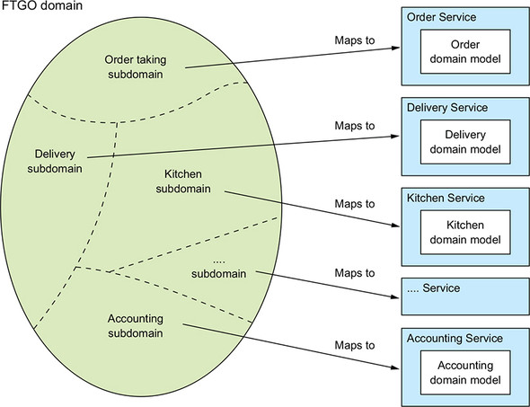

하위 도메인에 의해 분해된 마이크로서비스 (출처: Microservices Patterns with Examples in Java)


###### 2-2-3. 서비스로 분해할 때 적용되는 가이드라인 

비즈니스 역량에 의한 분해와 하위 도메인에 의한 분해는 애플리케이션에 마이크로서비스 아키텍처를 정의하기 위한 2개의 중요한 패턴이다. 하지만 객체 지향 설계에 그 뿌리를 두고 있는 이 분해 작업에는 매우 유용한 2가지 가이드라인이 있다. 


▶ 단일 책임 원칙 (SRP, Single Responsibility Principal)

*"각각의* *클래스는* *단지* *하나의* *변경* *사유를* *가져야* *한다."*

*- Robert C. Martin -*

소프트웨어 아키텍처와 디자인의 주요 목표 중에 하나는 각 소프트웨어 요소의 책임을 결정하는 것으로, 이렇게 각각의 클래스에게 할당된 책임은 해당 클래스를 수정할 때 근거가 된다. 하나의 클래스가 독립적으로 변경될 수 있는 책임을 여러 개 가지고 있다면 그 클래스는 안정적일 수 없다. SRP에 따르면 각각의 클래스는 하나의 책임을 가지고 따라서 하나의 변경 사유만을 가져야 한다. 우리는 마이크로서비스 아키텍처를 정의할 때 SRP를 적용하여 각각이 하나의 책임을 가지는 작고 응집된 서비스를 생성해야 한다. 이를 통해 서비스의 크기는 줄어들고 안정성은 증가할 것이다. 


▶ 공통 폐쇄 원칙 (CCP, Common Closure Principal) 

*"하나의* *패키지에* *포함된* *클래스들은* *동일한* *유형의* *변화에* *대해* *함께* *반응한다.* 

*패키지에* *영향을* *주는* *변화는* *패키지에* *포함된* *모든* *클래스에* *동일하게* *영향을* *준다*. "

*Robert C. Martin*

만약 동일한 사유로 2개의 클래스가 함께 변경되어야 한다면 이 클래스들은 같은 패키지로 묶여 있어야 한다는 것이다. 어쩌면 이 클래스들은 특정 비즈니스 규칙을 서로 다른 관점으로 구현한 것일 수 있다. 이 원칙의 목적은 비즈니스 규칙이 변경되었을 때 개발자들은 소수의, 가능하면 하나의 패키지만 수정할 수 있어야 한다는 것이다. CCP를 엄격하게 지키면 애플리케이션의 유지보수성이 급격히 개선된다. 

마이크로서비스 아키텍처에 CCP를 적용하면, 동일한 사유로 변경되어야 하는 콤포넌트들을 하나의 서비스로 묶을 수 있다. 이렇게 함으로써 어떤 요구사항이 변경되었을 때 변경해서 배포해야 하는 서비스의 숫자를 최소화할 수 있다. 하나의 변화는 하나의 팀과 하나의 서비스에만 영향을 주는 것이 가장 이상적이다. 


##### 2-3. 서비스 API의 정의 

마이크로서비스를 정의하는 마지막 단계는 서비스의 API를 정의하는 것이다. 이를 위해 우선 첫단계에서 식별된 시스템 오퍼레이션들을 각각 서비스에 할당해야 한다. 그런데 이 때 하나의 서비스가 오퍼레이션 전체를 단독으로 구현할 수도 있지만, 다른 여러 개의 서비스들과 협업해야 하는 경우도 있다. 이에 따라 협업을 위하여 다른 서비스들이 제공해야 하는 서비스 API도 정의해야 한다. 


▶ 시스템 오퍼레이션을 서비스에 할당하기 

서비스 API를 정의하려면 우선 각각의 요청에 대해 첫번째 접점이 되는 서비스를 찾아야 한다. 통상 시스템 오퍼레이션을 매핑할 서비스는 쉽게 찾을 수 있는데, 가끔 어떤 서비스와 매핑해야 하는지 명확하지 않을 수도 있다. 오퍼레이션은 이것을 처리하기 위해 필요한 핵심 정보를 소유한 서비스에 할당하는 것이 일반적이지만, 경우에 따라 오퍼레이션이 제공하는 정보를 사용하는 서비스에 할당하는 것이 더 나은 경우도 있다. 예를 들어, 배달원의 위치를 추적하는 오퍼레이션은 배달원이라는 핵심 정보를 소유한 배달원 서비스에 할당되는 것이 맞는 거 같지만 경우에 따라 배달원의 위치를 사용하는 배달 서비스에 할당하는 것이 적합할 수도 있다. 


▶ 서비스 간의 협업을 위한 API 정의하기 

어떤 시스템 오퍼레이션은 하나의 서비스 안에서 모두 처리될 수 있다. 하지만 어떤 시스템 오퍼레이션들은 요청을 처리하기 위해 필요한 데이터가 여러 개의 서비스에 흩어져 있어서 다른 서비스들과 협업을 통해 구현해야 한다. 따라서 서비스 API를 완벽하게 정의하기 위해서는 상기와 같은 경우 서비스 간 협업을 위하여 다른 서비스들이 제공해야 하는 API를 추가로 정의해야 한다. 


### 3장. 마이크로서비스의 프로세스간 통신 (1)

#### 1. 마이크로서비스 아키텍처 관점에서 본 프로세스간 통신 

모노리틱 애플리케이션에서는 함수 또는 메소드 호출을 통해 다른 모듈의 기능을 쉽게 이용할 수 있지만, 마이크로서비스 아키텍처에서 하나의 애플리케이션은 다수의 독립적인 서비스들로 구성된 분산 시스템이기 때문에 서비스들이 상호 통신하기 위해서는 프로세스간 통신(Inter-Process Communication)을 이용해야 한다. 특히 어떤 프로세스간 통신 메커니즘을 이용하느냐가 애플리케이션의 가용성에 상당한 영향을 주기 때문에 마이크로서비스에서 프로세스간 통신 메커니즘의 선택은 매우 중요한 아키텍처 디자인 항목이다. 따라서 마이크로서비스 아키텍처를 적용하기 위해서는 프로세스간 통신(IPC)이 무엇이고 어떤 종류가 있는지 그리고 각각의 장단점은 무엇인지에 대해 이해할 필요가 있다. 


##### 1.1 상호작용 스타일

먼저 서비스와 클라이언트 사이에 발생하는 상호작용 스타일에 어떤 것들이 있는지부터 알아보자. 서비스와 클라이언트 사이에 발생하는 상호작용은 매우 다양한데 크게 두가지 분류 기준에 따라 나누어 볼 수 있다. 하나는 상호작용하는 서비스와 클라언트의 수에 따라 일대일(One-to-One) 또는 일대다(One-to-Many)로 구분하는 것이고, 또 하나는 응답 방식에 따라 동기 방식(Synchronous)와 비동기 방식(Asynchronous)로 구분하는 것이다. 이는 다시 아래와 같이 5가지 유형으로 나누어 볼 수 있다. 

|          | 일대일                                                       | 일대다                                                       |
| -------- | ------------------------------------------------------------ | ------------------------------------------------------------ |
| 동기식   | · 요청/응답 (Request/Resposne)                               |                                                              |
| 비동기식 | · 비동기 요청/응답 (Async  Request/Response)  · 일방향 알림 (One-way Notification) | · 게시/구독 (Publish/Subscribe)  · 게시/비동기 응답  (Publish/Async Response) |

· 요청/응답: 클라이언트는 자신의 요청에 대해 응답을 회신할 때까지 후속 프로세스를 실행하지 않고 기다린다. 

· 비동기 요청/응답: 요청에 대해 즉각적인 응답을 하지 않으며 클라이언트는 대기없이 후속 프로세스를 수행한다. 

· 일방향 알림: 클라이언트는 서비스에 요청(메시지)를 전달만 하고 응답을 기다리지 않는다. 

· 게시/구독: 클라이언트는 알림 메시지를 게시하고 관련 서비스들은 이를 구독한다. 

· 게시/비동기 응답: 클라이언트는 알림 메시지를 게시하고 일정 시간 동안 서비스로부터 응답을 기다린다. 


##### 1.2 API 정의하기 - API 우선 전략 (API First Approach)

API는 소프트웨어 개발의 핵심이다. 통상 하나의 애플리케이션은 여러 개의 모듈로 구성되는데, 각 모듈은 자신의 오퍼레이션을 타 모듈 또는 외부에서 호출하여 사용할 수 있도록 API를 제공한다. 잘 설계된 API는 상세한 구현 내역을 드러내지 않으면서도 유용한 기능들을 외부에 제공한다. 

API는 어떤 IPC 메커니즘을 선택하느냐에 따라 특성이 달라진다. 예를 들어 메시징을 선택하면 API는 메시지 채널(message channel), 메시지 유형(message type), 메시지 포맷(message format)으로 구성된다. 반면 HTTP를 선택하면, API는 URL, HTTP Verb 그리고 요청/응답 포맷으로 구성된다. 


##### 1.3 API 변화관리 - 시맨틱 버저닝 (Semantic Versioning)

API는 변경 없이 계속 사용되는 것이 아니라 새로운 기능이 추가되고, 기존 기능이 수정되며, 오래된 기능이 제거되는 등 시간의 흐름에 따라 끊임없이 변한다.  마이크로서비스 기반의 애플리케이션의 경우 클라이언트는 통상 다른 팀에서 개발된 서비스이거나 외부에서 개발된 애플리케이션이기 때문에 모든 클라이언트를 일괄 업데이트하는 것은 불가능하다. 더욱이 최근에는 유지보수를 위한 다운타임을 가질 수 없어서 신/구 버전의 서비스가 동시에 운영되는 경우도 있다. 이와 같은 상황에서 API의 변경을 관리하기 위한 방안 중의 하나가 시맨틱 버저닝(Semantic Versioning)을 이용하는 것이다. 

▶ 시맨틱 버저닝 (Semantic Versioning)

시맨틱 버저닝 명세는 API 버전 관리를 위해 매우 유용한 가이드를 제공한다. 여기에는 어떻게 버전 번호를 사용하고 증가시켜야 하는지를 규정하는 일련의 규칙들이 기술되어 있다. 시맨틱 버전닝은 원래 소프트웨어 패키지의 버전 관리를 위해 고안된 것이지만, 분산 시스템의 API 버전 관리에도 적용될 수 있다. 시맨틱 버저닝 명세에 따르면 버전 번호는 MAJO. MINOR. PATCH의 3개로 구성되며 아래의 규칙에 따라 증가한다. 

· MAJOR 번호 : 기존 API와 호환이 되지 않은 변경이 있는 경우 

· MINOR 번호 : 기존 API와 호환성을 유지하는 변경이 있는 경우 

· PATCH 번호 : 기존 API와 호환성을 유지하면서 오류를 수정하는 경우 

▶ 호환성이 유지되는 Minor 변경

원칙적으로 모든 변경은 이전 버전과 호환되도록 만들어야 한다. 요청에 선택 속성을 추가하거나, 응답에 속성을 추가 또는 신규 오퍼레이션을 추가하는 것와 같이 API에 무언가를 추가하는 변경은 이전 버전과 호환성을 유지할 수 있다.  서비스는 전달받는 요청에 필요한 속성이 누락된 경우 기본값으로 처리할 수 있어야 하고, 클라이언트는 회신받은 응답에 추가적인 속성이 있을 경우 이를 무시할 수 있어야 한다. 이것이 무리 없이 진행되도록 하려면 서비스와 클라이언트가 모두 견고성 원칙(Robustness Principle)을 지원하는 요청/응답 포맷을 사용해야 한다.

▶ 호환성을 깨는 Major 변경

때로는 이전 버전과 호환이 되지 않는 Major 변경을 만들어야 하는 경우도 있다. 이 경우 모든 클라이언트를 일시에 업그레이드할 수 없기 때문에 일정 기간 동안 신/구 버전의 API를 모두 지원해야 한다. 만약 REST와 같은 HTTP 기반의 IPC 메커니즘을 이용하고 있다면 URL에 Major 버전 번호를 포함하여 관리할 수도 있다. 예를 들면 버전 1의 경로는 '/v1/…'를 포함하고 버전 2의 경로는 '/v2/…'를 포함하는 방식이다. 또는 버전 번호를 MIME 타입에 포함하는 HTTP의 컨텐트 협상 메커니즘(HTTP’S content negotiation mechanism)을 사용할 수도 있다. 예를 들면 클라이언트가 버전 1.x의 주문 서비스에 요청을 보낼 때는 아래와 같이 사용하는 것이다. 

```cmd
GET /orders/xyz HTTP/1.1

Accept: application/vnd.example.resource+json; version=1

...
```


##### 1.4 메시지 포맷

IPC의 핵심은 메시지를 교환하는 것이다. 메시지는 통상 데이터를 포함하고 있기 때문에 데이터의 포맷을 결정하는 것은 매우 중요한 디자인 결정 사항이다. 메시지 포맷은 텍스트 포맷과 바이너리 포맷의 2가지 유형으로 분류할 수 있다.


▶ 텍스트 메시지 포맷

첫 번째는 JSON, XML과 같은 텍스트 메시지 포맷이다. 이 포맷의 장점은 사람이 읽을 수 있다는 것과 메시지 만으로 내용이 충분히 전달된다는 것이다. JSON은 명명 속성(named properties)의 집합이고, XML은 명명 속성과 값(named element and value)의 집합이다. 이 포맷들은 메시지 소비자가 필요한 속성들만 선택하고 나머지는 무시할 수 있도록 해준다. 결국 메시지 스키마가 변경되어도 이전 버전과 호환성을 유지하기가 쉽다. 

텍스트 메시지 포맷의 단점은 메시지가 너무 쉽게 커진다는 것이다. 모든 메시지는 속성값 외에 그 속성의 명칭이라는 오버헤드를 가지고 있다. 또한 메시지를 분리하려면 별도의 오버헤드가 발생한다. 결국 효율성과 성능이 중요하다면 바이너리 포맷을 선택하는 것이 좋다. 

▶ 바이너리 메시지 포맷

바이너리 메시지 포맷에는 여러 가지 유형이 있는데, 최근에는 Protocol Buffer와 Avro가 널리 사용되고 있다. 두 가지 모두 메시지 구조를 정의할 수 있도록 규격화된 IDL을 제공하고, 컴파일러는 메시지의 직렬화 및 역직렬화를 위한 코드를 자동으로 생성해준다. 


#### 2. 원격 프로시저 호출 패턴을 이용한 동기식 통신

원격 프로시저 호출 기반의 IPC는 클라이언트가 서비스에 요청을 보내면 서비스가 요청을 처리하고 클라이언트에게 응답을 보내는 구조로 되어 있다. 일부 비동기식으로 서비스의 응답이 없어도 클라이언트가 후속 프로세스를 수행하는 경우도 있지만, 통상은 동기식으로 응답을 받을 때까지 클라이언트는 프로세스를 멈추고 기다린다. 

동기식 통신 프로토콜에는 여러 종류가 있는데, 대표적인 것이 REST와 gRPC이다. 그리고 동기식 통신을 사용하는 경우에는 서비스의 가용성을 높이기 위하여 부분 실패(Partial Failure)를 적절히 관리할 수 있어야 한다. 또한 마이크로서비스 기반의 애플리케이션에서는 서비스 탐색 메커니즘(Service Discovery Mechanism)도 중요하다. 


##### 2.1 REST 사용하기 

요즘은 RESTful 스타일로 API를 개발하는 것이 유행이다. REST는 HTTP를 사용하는 IPC 메커니즘으로, REST의 창안자인 로이 필딩(Roy Fieldling)은 다음과 같이 정의하고 있다. 

*REST는* *전체적으로* *함께* *적용되어* *컴포넌트* *상호작용의* *확장성,* *인터페이스* *일반화,* *컴포넌트의* *독립적인* *배포,* *통신* *지연을* *줄이기* *위한* *중개* *컴포넌트를* *중시하고,* *보안을* *강화하고* *레거시* *시스템을* *캡슐화하여* *숨기기* *위한* *일련의* *아키텍처* *제약사항을* *제공한다. -*  

REST의 핵심은 비즈니스 객체 또는 비즈니스 객체들의 집합을 나타내는 리소스(Resource)이며, HTTP Verb를 이용하여 이 리소스를 관리한다. 예를 들어 GET 요청에는 XML 문서 또는 JSON 객체의 형태로 표현된 리소스의 표현물(Representation)을 회신하고, POST 요청은 리소스를 생성하며, PUT 요청은 리소스를 수정한다. 

 

##### 2.2 gRPC 사용하기 

REST는 지원하는 Verb의 종류가 한정되어 있어서 복수의 업데이트 오퍼레이션 수행을 지원하는 API를 구현하는 것이 간단하지 않다. 이 문제를 해결할 수 있는 IPC 기술 중의 하나가 gRPC인데, 이것은 서로 다른 언어로 개발된 클라이언트와 서버를 지원하는 프레임워크이다 .

gRPC는 바이너리 메시지 기반의 프로토콜로서 자연스럽게 API 우선 접근법(API-first Approach)을 따르게 된다. gRPC API는 프로토콜 버퍼의 IDL을 사용하는데, 이것은 구조화된 데이터의 직렬화를 지원하는 구글의 언어 중립적인 메커니즘이어서 컴파일러는 Java, C#, NodeJS 그리고 GoLang 등 다양한 언어로 클라이언트 사이드 스텁과 서버 사이드 스켈리톤을 생성할 수 있다. 그리고 이것은 HTTP/2를 사용하여 메시지를 교환한다. 

gRPC API는 하나 이상의 서비스와 요청/응답 메시지로 구성된다. 서비스는 자바 인터페이스와 유사하게 엄격히 규격화된 메소드들의 집합이다. gRPC는 간단한 요청/응답뿐 아니라 스트리밍도 지원하는데, 서버가 클라이언트에 메시지 스트림을 반환할 수도 있고, 반대로 클라이언트가 서버에 메시지 스트림을 보낼 수도 있다. 

gRPC는 효율적이고 간결한 바이너리 포맷인 프로토콜 버퍼를 메시지 포맷으로 사용한다. 이 포맷은 태그를 사용하기 때문에 메시지의 각 필드에는 번호가 붙어있고 데이터 유형에 대한 코드를 가지고 있다. 메시지의 수신자는 필요한 필드만 추출하고 인식하지 못하는 필드들은 무시할 수 있다. 결국 gRPC는 이전 버전과 호환성을 유지하면서 API가 진화하도록 할 수 있다. 


##### 2.3 부분 실패 처리하기 

분산 시스템에서 클라이언트가 서비스와 동기 방식으로 통신을 하면 언제나 부분 실패(Partial Failure)가 발생할 수 있다. 오류 또는 기타의 사유로 응답을 해야 하는 서비스가 다운되어 있을 수도 있고, 아니면 과도한 요청으로 인해 응답 속도가 극히 저하되어 있을 수도 있다. 동기 방식에서는 서비스로부터 응답이 올 때까지 클라이언트가 대기 상태로 있으므로 응답 실패는 클라이언트의 클라이언트 또는 그 이상으로 전이되어 시스템을 다운시킬 수도 있다. 따라서 부분 실패가 전체 애플리케이션으로 퍼지지 않도록 설계하는 것은 매우 중요하다. 이를 위해서는 RPI 프록시가 서비스의 응답을 무한정 기다리지 않아야 하며 또한 원격 서비스의 응답 실패를 처리할 수 있어야 한다. 


▶ 무기한 대기 상태 피하기 

동기식 통신을 할 때는 언제나 넷플릭스에서 사용되었던 아래의 기법들을 적용하여 무기한 대기 상태에 빠지지 않도록 보호해야 한다. 

· 네트워크 타임아웃 (Network Timeout) – 서비스의 응답에 대한 대기 제한 시간을 설정하여 리소스가 무한정으로 기다리지 않도록 한다. 

· 미처리 요청의 수 제한 (Limiting the number of out-standing requests) – 서비스로 전달되는 요청에 대한 대기 건수의 상한선을 설정하고, 상한선에 도달하면 추가적으로 요청을 보내지 말고 즉시 실패로 처리한다. 

· 서킷 브래이커 패턴 (Circuit Breaker Pattern) – 성공한 요청과 실패한 요청의 숫자를 추적하고, 만약 실패율이 일정 한도를 초과하면 서킷 브래이커를 열어서 추가적인 요청을 모두 즉시 실패로 처리한다. 일정 시간 후에 다시 요청을 보내서 만약 성공하면 서킷 브래이커를 닫는다. 

▶ 원격 서비스의 응답 실패 처리하기

원격 서비스가 사용할 수 없는 상태가 되었을 경우 이것을 호출한 서비스를 어떻게 복구할 것인지에 대해 케이스 별로 대응 방안을 정해야 한다. 한가지는 클라이언트에게 단순히 실패 메시지만 회신하는 것이다. 또 어떤 경우엔 기본값 또는 캐쉬 값과 같이 사전에 정의된 값(fallback value)을 응답으로 회신하는 것이 적합할 때도 있다. 


##### 2.4 서비스 탐색 패턴

분산 시스템에서 서비스에 요청을 전송하기 위해서는 해당 서비스의 네트워크 주소(IP 주소와 포트)를 알아야 하는데, 전통적인 애플리케이션의 경우 이것이 그리 어렵지 않다. 서비스의 네트워크 주소가 거의 변하지 않기 때문에 설정 파일에 기록해 놓고 필요할 때 읽어오면 된다. 하지만 최근에 등장한 클라우드 기반의 마이크로서비스 애플리케이션에서는 서비스의 네트워크 주소가 고정되어 있지 않다. 게다가 자동 확장(Auto scaling), 실패, 업그레이드 등으로 인해 서비스의 주소는 동적으로 변한다. 결국 클라이언트는 서비스의 주소를 찾기 위하여 서비스 탐색 메커니즘을 이용해야 한다. 

서비스 탐색의 개념은 매우 간단하다. 이 메커니즘의 핵심은 서비스 레지스트리(Service Registry)로, 이것은 서비스 인스턴스들의 네트워크 주소를 저장하고 있는 일종의 데이터베이스이다. 서비스 탐색 메커니즘은 서비스 인스턴스들이 기동되거나 멈출 때마다 서비스 레지스트리를 업데이트하고, 클라이언트가 서비스를 호출할 때 서비스 레지스트리에서 가용한 서비스 인스턴스의 목록을 조회하여 이들 중 하나에 요청을 전달한다. 이러한 서비스 탐색 메커니즘을 구현하는 방법에는 2가지가 있다. 


▶ 애플리케이션 레벨의 서비스 탐색 패턴

서비스 탐색을 구현하는 방법 중 한가지는 서비스와 클라이언트가 서비스 레지스트리와 직접 통신하도록 만드는 것이다. 

▶ 플랫폼이 제공하는 서비스 탐색 패턴

도커(Docker), 쿠버네티스(Kubernetes)와 같은 배포 플랫폼은 자체적으로 구현한 서비스 레지스트리와 서비스 탐색 메커니즘을 가지고 있다. 

 

#### 3장. 마이크로서비스의 프로세스간 통신 (2)

 3. ##### 메시징 패턴을 이용한 비동기 통신

메시징을 이용하면 비동기 방식으로 통신할 수 있다. 클라이언트는 서비스에게 메시지를 보내어 요청을 전달하고, 서비스는 클라이언트에게 응답으로 메시지를 회신하는데, 비동기 방식이기 때문에 클라이언트는 응답이 즉시 오지 않는다는 전제 하에 응답이 올 때까지 기다리지 않고 후속 프로세스를 진행한다. 


##### 3.1 메시징의 개요

일반적으로 메시지는 메시지 채널을 통해 교환된다. 즉, 아래의 그림과 같이 송신자(Sender)의 비즈니스 로직은 송신 포트(Sending Port)를 통해 메시지 송신자(Message Sender)를 호출하여 메시지 채널에 메시지를 배포하고, 수신자(Receiver)의 메시지 핸들러(Message Handler)는 메시지 채널에서 메시지들을 읽어 와서 수신 포트(Receiving Port)를 통해 수신자의 비즈니스 로직에 전달한다. 


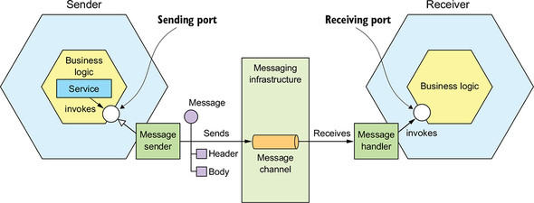

출처: Microservices Patterns with Examples in Java

▶ 메시지 (Message)

메시지는 헤더(Header)와 본문(Body)으로 구성된다. 헤더는 본문의 데이터를 설명하는 명칭:값의 형식으로 된 메타 데이터의 집합으로 메시지 아이디와 응답을 수신할 메시지 채널 등의 추가 정보를 포함하고 있으며, 메시지 본문은 텍스트 또는 바이너리 포맷으로 전송되는 데이터이다. 이러한 메시지는 아래와 같이 3가지 유형으로 분류된다.

· 문서(Document) - 데이터만 포함된 메시지로, 커맨드에 대한 응답으로 회신되는 메시지가 이 유형에 속한다. 

· 커맨드(Command) – RPC와 유사한 메시지로, 이 메시지에는 호출할 오퍼레이션과 매개변수들이 명시된다. 

· 이벤트(Event) – 송신자에게 무엇인가 유의미한 상태 변화가 발생했다는 것을 알려주는 메시지로, 주문 또는 고객과 같은 도메인 객체의 상태에 변경이 발생했다는 것을 알려주는 도메인 이벤트가 이에 해당한다. 


▶ 메시지 채널 (Message Channel)

메시지 채널은 메시지가 교환되어 이동하는 메시징 인프라스트럭쳐를 추상화한 개념으로, 점대점 방식과 게시/구독 방식의 2종류가 있다. 

· 점대점 방식(Point-to-Point): 메시지 소비자 중 하나에게만 메시지를 전달하며, 커맨드 메시지와 같이 일대일 상호작용을 위해 사용된다 

· 게시/구독 방식(publish-subscribe): 메시지 소비자 모두에게 메시지를 전달하며, 이벤트 메시지와 같이 일대다 상호작용을 위해 사용된다 


##### 3.2 메시징을 이용한 상호작용 구현하기

메시징을 이용하면 요청/응답, 비동기 요청/응답, 일방향 알림, 게시/구독, 게시/비동기 응답과 같이 앞서 논의했던 모든 동기/비동기 상호작용의 구현이 가능하다. 


▶ 요청/응답과 비동기 요청/응답

클라이언트와 서비스는 한 쌍의 메시지를 교환함으로써 비동기 방식의 요청/응답을 구현할 수 있다. 즉, 클라이언트는 오퍼레이션과 매개변수가 명시된 커맨드 메시지를 점대점 채널을 통해 서비스에 전송하고 서비스는 요청을 처리한 후 결과물이 포함된 응답 메시지를 클라이언트의 점대점 채널로 보냄으로써 비동기식 요청/응답을 구현한다. 메시징은 태생적으로 비동기 방식이므로 원래 비동기 요청/응답 방식만을 지원하지만, 응답을 받을 때까지 클라이언트를 대기 상태로 만들 게 되면 동기식 요청/응답 방식도 구현이 가능하다

여기서 고려해야 할 점은 클라이언트가 요청을 전송할 때 응답 메시지를 어디로 보내야 할지를 알려 주어야 한다는 것과 서비스로부터 회신된 응답 메시지가 어떤 요청에 대응되는 것인지를 찾을 수 있어야 한다는 점이다. 다행히 이것은 그리 어려운 문제가 아니다. 클라이언트는 커맨드 메시지를 전송할 때 헤더에 응답 채널을 포함하여 전송하면 되고, 서비스는 요청 메시지에 포함된 메시지 아이디를 응답 메시지에 연관 아이디로 포함하여 응답 채널로 전송하고 클라이언트는 이 연관 아이디를 가지고 요청에 대한 응답이 맞는지 확인하면 된다. 


▶ 일방향 알림

비동기 메시징을 이용하여 일방향 알림을 구현하는 것은 매우 간단하다. 클라이언트는 메시지, 통상은 커맨드 메시지를 서비스가 소유한 점대점 채널로 전송한다. 서비스는 채널을 구독하여 커맨드 메시지를 처리하지만 별도로 응답을 회신하지는 않는다. 


▶ 게시/구독

메시징은 게시/구독 방식의 상호작용을 쉽게 구현할 수 있다. 즉, 메시지 생산자가 게시/구독 방식의 채널에 메시지를 게시하면 관심이 있는 메시지 소비자들은 상기 채널에서 메시지를 읽어가서 사용하게 된다. 통상 게시/구독 방식은 도메인 객체의 변화를 나타내는 이벤트를 게시하기 위하여 주로 사용된다. 예를 들어 주문 서비스가 주문 채널에 주문의 변화를 나타내는 이벤트를 게시하면 연관 서비스들은 주문 채널을 구독하고 이벤트 메시지를 읽어서 주문의 상태 변화를 파악한다. 


▶ 게시/비동기 응답

게시/비동기 응답 방식은 게시/구독과 요청/응답의 요소들을 조합하여 구현된 좀 더 상위 레벨의 상호작용이다. 클라이언트는 응답 채널 헤더가 명시된 메시지를 게시/구독 채널에 게시하고, 메시지 소비자는 연관 아이디가 포함된 응답 메시지를 작성하여 응답 채널로 보낸다. 그러면 클라이언트는 연관 아이디를 사용하여 자신의 요청에 맞는 응답을 찾아서 사용한다. 


##### 3.3 메시징 기반 API 명세서 작성

메시징 기반 API 명세서에는 채널의 명칭, 메시지의 유형 및 포맷 등이 명시되어야 하는데, 특히 메시지 포맷은 JSON, XML 또는 Protobuf와 같은 표준을 사용하여 기술되어야 한다. 단, 메시징에는 REST나 Open API와 같이 널리 채택된 표준은 없기 때문에 비공식 문서를 이용하여 작성할 수 밖에 없다. 

메시징 기반 API는 크게 서비스의 오퍼레이션을 호출하기 위한 API와 서비스의 이벤트를 게시하기 위한 API로 분류할 수 있는데, 이것들은 서로 다른 방식으로 문서화된다.


▶ 오퍼레이션을 호출하는 API 명세서

오퍼레이션을 호출하는 API는 일방향 알림 방식과 요청/비동기 응답 방식으로 나뉘는데 유형에 따라 API 명세서의 구성이 달라진다. 일방향 알림 방식의 API 명세서는 커맨드 메시지 채널과 커맨드 메시지의 유형 및 포맷으로 구성된다. 반면 요청/비동기 응답 방식의 경우에는 상기의 정보와 함게 응답 메시지의 유형과 포맷이 추가로 포함된다. 


▶ 이벤트를 게시하는 API 명세서 

이벤트를 게시하는 API는 게시/구독 방식으로 구현되며, 따라서 API의 명세서는 이벤트 메시지를 게시할 채널과 메시지의 유형 및 포맷으로 구성된다. 


##### 3.4 메시지 브로커 사용하기

메시징 기반의 애플리케이션은 일반적으로 서비스 간의 통신을 지원하는 인프라스트럭처 서비스인 메시지 브로커를 사용한다. 서비스들이 상호 통신을 통해 직접 메시지를 교환하는 브로커리스 메시징 아키텍처를 사용할 수도 있지만, 일반적으로는 브로커 기반의 메시징이 좀 더 나은 방법으로 받아들여지고 있다. 


▶ 브로커리스 메시징 아키텍처

브로커리스 메시징 아키텍처에서는 서비스들이 상호 통신을 통해 직접 메시지를 교환한다. ZeroMQ([http://zeromq.org](http://zeromq.org/))는 대표적인 브로커리스 메시징 기술 중의 하나로서, 다양한 언어를 지원하는 명세서와 일련의 라이브러리로 구성되어 있으며 TCP, UNIX 스타일의 도메인 소켓, 멀티 캐스트 등 다양한 통신 방법을 지원한다. 


브로커리스 메시징은 메시지 브로커 없이 직접 메시지가 전달되기 때문에 네트워크 트래픽과 네트워크 지연이 적고, 메시지 브로커의 병목현상으로 인한 성능 저하 또는 단일 장애점 문제가 발생하지 않으며, 셋업하거나 관리해야 하는 메시지 브로커가 없기 때문에 운영상의 복잡성이 상대적으로 적다는 장점이 있다. 

하지만 서비스들이 직접 메시지를 전송하기 위해서는 상호간의 주소를 찾을 수 있는 탐색 메커니즘을 구현해야 하고 메시지의 교환이 발생하는 동안 송신자와 수신자 모두 가용 상태를 유지해야 하므로 가용성이 떨어진다는 점, 그리고 전송 보장 같은 메커니즘의 구현이 상당히 어렵다는 문제점이 있다. 


▶ 메시지 브로커의 개요

메시지 브로커(Message Broker)는 메시지가 흘러 지나가는 중계소로, 송신자가 메시지를 작성하여 메시지 브로커에서 전달하면 메시지 브로커는 이를 읽어서 수신자에게 전달한다. 메시지 브로커를 사용하게 되면 송신자가 메시지 소비자의 위치를 알 필요가 없으며, 또한 메시지 소비자가 메시지를 처리할 수 있을 때까지 메시지를 버퍼링하면서 기다리는 등 여러가지 장점이 있다. 

메시지 브로커에는 여러 종류가 있는데, 오픈 소스 기반의 메시지 브로커 중에는 ActiveMQ, RabbitMQ , Apache Kafka 가 많이 사용된다. 그리고 클라우드 기반의 메시지 브로커로서 AWS Kinesis 또는 AWS SQS도 많이 사용된다. 


각각의 메시지 브로커는 서로 다른 장단점을 가진다. 예를 들어 지연시간이 짧은 메시지 브로커는 메시지 순서를 유지하지 못하고 메시지 전달을 보장하지 않으며 메시지를 메모리에만 보관한다. 반면 메시지 전달을 보장하고 디스크에 메시지를 안전하게 저장하는 메시지 브로커는 통상 지연시간이 길다. 따라서 애플리케이션의 요구사항에 따라 어떤 메시지 브로커를 사용할 지를 결정해야 한다. 


▶ 브로커 기반 메시징의 장점

· 느슨한 연결 – 메시지 브로커가 메시지를 중계하기 때문에 클라이언트는 서비스의 위치를 찾기 위해 탐색 메커니즘을 구현할 필요가 없으며 적합한 메시지 채널을 선택하여 메시지를 전송하기만 하면 된다. 

· 메시지 버퍼링 – 메시지 브로커는 수신자가 메시지를 처리할 수 있을 때까지 메시지를 버퍼링한다. 따라서 메시징을 이용하면 수신자가 일시적으로 다운되더라도 메시지를 순서대로 전달할 수 있다. 

· 유연한 통신 방식 – 메시징은 앞에서 논의된 모든 종류의 상호작용 방식을 지원한다. 

· 명시적인 프로세스간 통신 – RPC 기반의 메커니즘은 원격 서비스 호출을 로컬 서비스 호출처럼 보이게 한다. 하지만 물리 법칙과 부분 실패의 가능성 때문에 실제로는 다르다. 메시징은 이러한 차이를 명시적으로 보여주기 때문에 개발자들이 보안 문제를 잘못 다루는 것을 방지해준다.


▶ 브로커 기반 메시징의 단점

· 성능 병목 문제 – 메시지 브로커가 성능 저하를 일으키는 병목 지점이 될 가능성이 있다. 

· 단일 장애점 문제 – 메시지 브로커가 다운되면 전체 시스템이 다운되는 문제가 발생할 수 있다. 

· 추가적인 운영 복잡성 – 메시징으로 인해 추가로 설치하고 설정/운영해야 하는 시스템 컴포넌트가 늘어난다. 


##### 3.5 메시지 전달 순서 보장

메시징을 사용할 때 발생하는 어려운 문제 중 하나는 어떻게 메시지 전달 순서를 유지하면서 메시지 수신자를 확장하느냐이다. 대량의 메시지를 처리하려면 복수의 서비스 인스턴스 또는 복수의 쓰래드를 사용하여 메시지들을 병행 처리할 수 있어야 한다. 그리고 또한 메시지가 순서대로 한번만 처리되도록 보장할 수 있어야 한다. 

예를 들어 3개의 서비스 인스턴스가 동일한 메시지 채널을 구독하고 있다고 있을 때, 송신자가 주문 생성, 주문 수정, 주문 취소 메시지를 순서대로 게시했다고 가정해보자. 상기 3개의 메시지가 각각 서로 다른 3개의 수신자에게 동시에 전달된다면 네트워크 지연, 가비지 컬렉션 등 여러가지 사유로 인해 메시지들이 순서대로 처리되지 않을 수 있다. 즉, 주문 생성 메시지가 처리되기 전에 주문 취소 메시지가 먼저 처리될 수 있게 된다. 

Apache Kafka나 AWS Kinesis와 같은 최근 메시지 브로커에서는 이와 같은 문제를 아래와 같이 샤드 채널(sharded channel, partitioned channel)을 이용하여 해결하고 있다. 

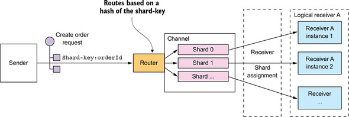

출처: Microservices Patterns with Examples in Java

하나의 샤드 채널은 2개 이상의 샤드로 구성되는데, 각각이 별도의 채널처럼 동작한다. 송신자는 메시지 헤더에 임의의 문자열 또는 바이트 시퀀스를 사용한 샤드 키를 명시하고, 메시지 브로커는 이 샤드 키를 사용하여 메시지를 특정 샤드 또는 파티션에 할당한다. 

그리고 메시지 브로커는 복수의 수신자 인스턴스를 하나로 묶어서 논리적으로 동일한 수신자로 취급한다. 예를 들면 Apache Kafka는 소비자 그룹(Consumer Group)이라는 용어를 사용한다. 메시지 브로커는 각각의 샤드를 하나의 수신자에게 할당한다. 수신자가 다시 기동되거나 셧다운되면 샤드를 재할당한다. 

상기 그림에서 각각의 주문 이벤트 메시지는 OrderId를 샤드 키로 가지고, 이에 따라 특정 주문의 이벤트들은 동일한 샤드에 게시되고 이것은 동일한 메시지 소비자에 의해 처리된다. 결국 이 메시지들은 순서대로 처리된다. 


##### 3.6 중복 메시지 처리

메시징을 사용할 때 해결해야 하는 또 다른 문제는 중복 메시지의 처리이다. 메시지는 한번씩만 전달되는 것이 가장 이상적이다. 하지만 정확히 한번만 전달되도록 보장하기는 정말 어렵다. 따라서 일반적으로 적어도 한번은 전달되도록 구현되는데, 이 경우 보통은 문제가 없지만 클라이언트, 네트워크 또는 메시지 브로커 등 메시지 전달 경로 어디에선가 실패가 발생하면 동일한 메시지가 여러 번 전달되는 상황아 발생할 수 있다. 

예를 들어 클라이언트가 메시지를 처리하고 데이터베이스를 업데이트하였으나 수신 확인 신호를 보내지 않은 상태에서 문제가 생기는 경우 메시지 브로커는 수신 확인을 받지 못했기 때문에 재기동된 클라이언트 또는 클라이언트의 다른 복제본에 동일한 메시지를 다시 전달한다. 


▶ 메시지를 추적하여 중복 메시지 제거하기

중복 메시지를 제거하는 간단한 방법 중 하나는 메시지 아이디를 가지고 기 처리된 메시지를 식별하여 신규 메시지만 처리하고 중복 메시지는 제거하는 것이다. 

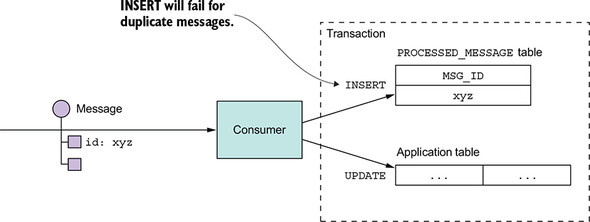

출처: Microservices Patterns with Examples in Java

예를 들면 상기 그림처럼 메시지 소비자가 기 처리한 메시지의 메시지 아이디를 데이터베이스에 저장해 놓고 새로운 메시지가 들어왔을 때 데이터베이스에 저장된 메시지들과 비교하여 신규 메시지인 경우 처리하고 중복 메시지시인 경우 제거하도록 하는 것이다. 상기 그림에서 기 처리된 메시지 데이터는 PROCESSED_MESSAGE 테이블에 저장된다. 


#### 4. 비동기 메시징을 통한 가용성 높이기

각각의 IPC 메커니즘은 서로 다른 장단점을 가지고 있다. 이러한 장단점 중 특별히 고려해야 하는 사항은 선택한 IPC 메커니즘이 애플리케이션의 가용성에 어떤 영향을 미치는 가이다. 통상 동기식 통신은 애플리케이션의 가용성을 감소시킨다. 따라서 가능하다면 동기식 통신보다는 비동기 메시징을 이용하도록 설계하는 것이 좋다. 

아예 비동기 API만 사용하도록 서비스를 정의하는 것이 가장 이상적인데 이것은 언제나 가능한 거은 아니다. 예를 들어 Public API들은 대체로 RESTful API들이어서 서비스들은 동기식 API를 사용할 수 밖에 없다. 그러나 다행히 클라이언트로부터 동기식 요청을 받더라도 다른 서비스에는 동기식 요청을 보내지 않고 처리할 수 있는 방법들이 있는데 이제 이에 대해 살펴보고자 한다. 


▶ 데이터 복제하기

동기식 통신을 최소화하는 한가지 방법은 데이터를 복제하는 것이다. 즉, 서비스는 요청을 처리하기 위해 필요한 데이터의 복제본을 만들고 원본 데이터의 상태 변화를 게시하는 이벤트를 구독하여 복제본을 최신 상태로 유지하는 것이다. 예를 들어 주문 서비스가 소비자 서비스 및 식당 서비스가 소유한 데이터의 복제본을 만들어 보유하고 있으면서 원본 데이터가 변경될 때마다 소비자 서비스와 식당 서비스가 게시하는 이벤트를 구독하여 복제본을 늘 최신 상태로 유지한다면 주문 서비스는 주문 생성 요청을 처리하기 위해 소비자 서비스 및 식당 서비스와 상호작용을 할 필요가 없다. 

한가지 문제점은 복제해야 하는 데이터의 양이 과도하게 커지면 이 방법은 매우 비효율적인 방법이 된다는 것이다. 또 다른 문제는 다른 서비스가 소유한 데이터를 조회만 하는 경우에는 문제가 없지만 원본 데이터를 수정해야 하는 경우에는 복제본을 사용하는 방법으로 해결이 되지 않는다는 점이다. 


▶ 응답을 우선 회신 후 잔여 작업 처리하기

요청을 처리할 때 동기식 통신을 제거하는 또 하나의 방법은 클라이언트의 요청을 받아서 먼저 로컬에서 사용이 가능한 데이터만 가지고 요청을 처리하고 그 결과를 응답으로 클라이언트에게 회신한 후 비동기 방식으로 다른 서비스들에게 메시지를 전송하여 요청 처리를 위한 후속 프로세스를 진행하는 것이다. 

예를 들어 주문 서비스가 주문 생성 요청을 처리할 때 먼저 주문 서비스가 보유한 정보를 가지고 주문 생성 요청을 검증하고 PENDING 상태로 주문을 생성한 후 다른 서비스들에게 비동기 방식으로 메시지를 전달하여 주문 생성 요청을 검증한다. 

상기 방안의 장점은 연관 서비스가 다운되었을지라도 주문 서비스는 주문 생성을 진행하고 클라이언트에게 응답을 회신할 수 있다는 것이다. 이후 연관 서비스가 복구되면 큐에 쌓여 있는 메시지를 통해 주문 검증을 완료하게 된다. 

하지만 이 방안은 클라이언트를 좀 더 복잡하게 만든다는 단점이 있다. 예를 들어 주문 서비스는 최초로 응답을 보낼 때 신규 주문에 대해 최소한의 보장만 한다. 즉, 주문 서비스는 메뉴 아이템에 대한 검증 또는 신용카드 인증을 하기 전에 응답을 먼저 보낸다. 따라서 주문이 정상적으로 생성되었는지를 알기 위해서는 클라이언트가 주기적으로 폴링을 하거나 주문 서비스가 알림 메시지를 보내야 한다. 이것이 다소 복잡한 것처럼 보이지만 많은 경우에 이 방법을 선호한다. 

 

### 4장. Saga를 이용한 트랜잭션 관리

#### 1. 마이크로서비스 아키텍처에서 트랜잭션 관리하기

##### 1.1 마이크로서비스 아키텍처의 트랜잭션 관리

하나의 데이터베이스를 사용하는 모노리틱 애플리케이션에서는 트랜잭션 관리가 간단하다. 예를 들어 소비자가 주문 가능한 상태인지, 주문 상세내역은 이상이 없는지를 검증하고 신용카드 결제를 처리한 후 데이터베이스에 주문을 저장하는 createOrder()라는 오퍼레이션을 생각해보자. 모노리틱 애플리케이션이라면 주문 검증을 위해 필요한 데이터가 모두 접근 가능하기 때문에 데이터 정합성을 보장하기 위해서는 ACID 트랜잭션을 사용하면 된다. 

하지만 마이크로서비스 아키텍처에서는 주문 검증을 위해 필요한 데이터들이 여러 개의 서비스에 흩어져 있다. 즉, 상기의 createOrder() 오퍼레이션은 소비자 서비스에 있는 데이터를 읽어야하고 주문 서비스, 주방 서비스 그리고 회계 서비스에 있는 데이터를 업데이트해야 한다. 결국 마이크로서비스 아키텍처에서는 하나의 트랜잭션이 여러 개의 서비스에 흩어져 있는 데이터에 접근해야 하기 때문에 좀 더 정교한 트랜잭션 관리 메커니즘이 필요하다. 


##### 1.2 분산 트랜잭션의 문제점. 

복수의 서비스, 데이터베이스, 메시지 브로커에 걸쳐있는 트랜잭션에서 데이터 정합성을 유지하기 위한 전통적인 방법은 분산 트랜잭션을 이용하는 것이다. 분산 트랜잭션은 통상 트랜잭션 안의 모든 작업이 일괄 커밋되거나 롤백되도록 보장하기 위해 [2단계 커밋(two-phase commit, 2PC)](https://swdev.tistory.com/2)을 사용한다. 

그런데 분산 트랜잭션은 몇가지 문제점을 가지고 있다. 우선 MongoDB, Cassandra와 같은 NoSQL 데이터베이스들과 RabbitMQ나 Apache Kafka와 같은 최신 메시지 기술들이 분산 트랜잭션을 지원하지 않는다. 결국 분산 트랜잭션의 사용하려면 몇가지 최신 기술을 포기해야 한다. 

또 다른 문제는 분산 트랜잭션이 가용성을 감소시킨다 점이다. 분산 트랜잭션을 커밋하기 위해서는 이에 참여하는 서비스들이 모두 가용해야 한다. 가용성은 트랜잭션에 참여하는 서비스 가용성의 곱에 비례하기 때문에 분산 트랜잭션에 참여하는 서비스가 늘어날 수록 가용성은 감소한다.

표면적으로는 분산 트랜잭션이 로컬 트랜잭션과 유사하기 때문에 상당한 유용한 것처럼 보이지만, 앞서 언급된 문제들로 인해 최신 애플리케이션에는 적합하지 못하다. 따라서 마이크로서비스 아키텍처에서는 트랜잭션의 데이터 정합성을 유지하기 위해 느슨한 연결과 비동기 서비스에 기반한 메커니즘인 Saga를 이용해야 한다. 


##### 1.3 Saga를 이용하여 데이터 정합성 유지하기

Saga는 순차적으로 실행되는 로컬 트랜잭션의 모음으로, 시스템 오퍼레이션에서 부터 시작하여 다수의 로컬 트랜잭션을 순차적으로 실행하는데 각 단계의 시작과 종료는 비동기 메시징을 통해 조율되며, 각각의 로컬 트랜잭션은 ACID 트랜잭션을 통해 데이터를 업데이트한다. 그리고 비동기 메시징은 Saga에 참여하는 모든 단계가 빠짐없이 실행되도록 보장해준다. 


▶ 주문 생성 사가 (Create Order Saga)

아래는 Saga를 이용하여 createOrder() 오퍼레이션을 구현하는 주문 생성 사가(Create Order Saga)의 예제이다. 주문 생성에 대한 외부 요청으로부터 Saga의 첫 번째 로컬 트랜잭션이 시작되며, 이어지는 5개의 로컬 트랜잭션은 각각 선행 트랜잭션이 종료되면 시작된다. 즉, 하나의 로컬 트랜잭션이 종료되면 서비스는 메시지를 게시하는데 이 메시지는 Saga의 다음 단계가 시작되도록 만든다.


출처: Microservices Patterns with Examples in Java

1. 주문 서비스 – APPROVAL_PENDING 상태로 주문을 생성한다. 
2. 소비자 서비스 – 소비자가 주문을 생성할 수 있는 지를 검증한다. 
3. 주방 서비스 – 주문 상세 내역을 검증하고 CREATE_PENDING 상태로 Ticket을 생성한다. 
4. 회계 서비스 – 소비자의 신용카드를 인증한다. 
5. 주방 서비스 – Ticket의 상태를 AWAITING_ACCEPTANCE로 변경한다. 
6. 주문 서비스 – 주문의 상태를 APPROVED로 변경한다. 

여기서 비동기 메시징은 Saga 참여자들이 느슨하게 연결되도록 해주며 또한 메시지 수신자가 일시적으로 가용하지 않으면 메시지를 전달할 수 있을 때까지 버퍼링하기 때문에 Saga의 모든 단계가 수행되도록 보장해준다. 


▶ 보상 트랙잭션(Compensating Transaction) 

Saga를 사용하는 것이 겉으로 보기에는 간단해 보이지만 몇가지 어려운 점이 있다. 그 중 한가지는 오류가 발생했을 때 변경사항을 원복하는 것이다. 전통적인 ACID 트랜잭션에서는 오류가 발생하면 롤백 명령을 통해 지금까지의 변경사항을 모두 일괄적으로 원복하면 된다. 하지만 Saga에서는 이전 단계의 변경사항이 커밋으로 로컬 데이터베이스에 이미 반영되어서 롤백을 통해 자동으로 원복되지 않기 때문에 별도의 보상 트랜잭션을 실행해야 한다. 


보상 트랜잭션(Compensating Transaction)은 원본 트랜잭션을 역으로 실행하여 취소 처리하는 트랜잭션으로, 예를 들어 주문 취소는 주문 생성에 대한 보상 트랜잭션이 된다. 만약 로컬 트랜잭션이 실패하면 Saga의 조율 메커니즘은 이전 단게에서 실행되었던 트랜잭션을 취소하는 보상 트랜잭션들을 실행한다. 아래의 표는 Create Order Saga의 각 단계에 대한 보상 트랜잭션을 보여준다. 

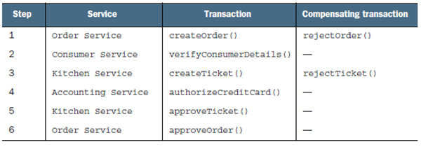

출처: Microservices Patterns with Examples in Java

그런데 모든 단계가 다 보상 트랜잭션을 필요로 하는 것은 아니다. 예를 들어 VerifyConsumerDetails()와 같은 조회용 트랜잭션은 보상 트랜잭션을 필요로 하지 않으며, 또한 authorizedCreditCard()와 같이 항상 성공하는 트랜잭션도 그렇다. Create Order Saga에서 앞의 3단계는 실패할 수 있는 단계들로 보상 트랜잭션이 필요한 원복 가능 트랜잭션(compensatable transactions), 4번째 단계는 이후 단계들이 절대 실패하지 않는 단계들이어서 피봇 트랜잭션(pivot transaction), 그리고 나머지 단계들은 항상 성공하는 단계들이어서 재시도 트랜잭션(retriable transactions)이라고 부른다. 


아래의 시나리오는 소비자의 신용카드 인증이 실패했을 경우 이전 단계의 트랜잭션들을 모두 원복하기 위해 보상 트랜잭션을 실행하는 사례이다. 

1. 주문 서비스 – APPROVAL_PENDING 상태로 주문을 생성한다. 
2. 소비자 서비스 – 소비자가 주문을 신청할 수 있는지 확인한다.
3. 주방 서비스 – 주문의 상세내역을 검증하고 CREATE_PENDING 상태로 티켓을 생성한다. 
4. 회계 서비스 – 소비자의 신용카드를 인증하는 과정에서 실패한다. 
5. 주방 서비스 – 티켓의 상태를 CREATE_REJECTED로 변경한다. 
6. 주문 서비스 – 주문의 상태를 REJECTED로 변경한다. 

상기 시나리오에서 1-3번 트랜잭션은 정상적으로 수행된 트랜잭션이고, 5-6번 트랜잭션이 주문 서비스와 주방 서비스가 만든 변경사항을 원복하기 위한 보상 트랜잭션이다. 


#### 2. Saga를 구현하는 방법

Saga는 Saga에 참여하는 각 단계들의 실행을 조율하는 로직들로 구성된다. 시스템 커맨드에 의해 Saga가 시작되면, Saga는 제일 먼저 실행될 참여자를 찾아서 해당 참여자의 로컬 트랜잭션을 실행하도록 지시하고, 해당 트랜잭션이 종료되면 다음 참여자를 찾아서 호출한다. 이 프로세스는 Saga에 참여하는 모든 단계가 실행될 때까지 계속되는데, 만약 중간에 로컬 트랜잭션이 실패하면 Saga는 보상 트랜잭션을 역순으로 실행한다. 

Saga를 구현하는 방법에는 두 가지가 있다. 하나는 각 단계의 실행 및 순서 관리를 Saga 참여자들에게 분산하는 코레오그레피(Choreography)로 참여자들은 이벤트 메시지를 통해 상호 통신한다. 또 하나는 Saga의 조율 로직을 중앙에서 관리하는 오케이스트레이션(Orchestration)으로, 여기서는 Saga Orchestrator가 참여자들에게 어떤 오퍼레이션을 실행해야 할 지를 지시하는 커맨드 메시지를 전송한다.


##### 2.1 코레오그레피 사가 (Choreography Saga)

코레오그레피 사가(Choreography Saga)는 Saga 참여자들이 무엇을 해야 하는지를 지시하는 중앙의 조율자를 가지고 있지 않다. 대신 Saga의 참여자들은 서로의 이벤트를 구독하고 이에 따라 반응하게 된다. 


아래는 Create Order Saga를 코레오그래피 기반으로 구현한 모습으로, 주문 서비스부터 시작하여 각 참여자들은 로컬 데이터베이스를 업데이트하고 다음 참여자를 호출하기 위한 이벤트를 게시한다. 

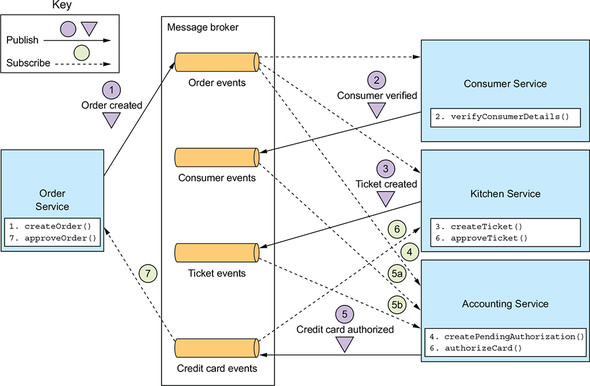

출처: Microservices Patterns with Examples in Java

① 주문 서비스는 APPROVAL_PENDING 상태로 주문을 생성하고 OrderCreated 이벤트를 게시한다. 

② 소비자 서비스는 OrderCreated 이벤트에 반응하여 소비자가 주문을 생성할 수 있는 상태인지 확인한 후 ConsumerVerified 이벤트를 게시한다. 

③ 주방 서비스는 OrderCreated 이벤트에 반응하여 주문을 검증하고 CREATE_PENDING 상태로 티켓을 생성한 후 TicketCreated 이벤트를 게시한다. 

④ 회계 서비스는 OrderCreated 이벤트에 반응하여 CreditCardAuthorization을 PENDING 상태로 생성한다. 

⑤ 회계 서비스는 TicketCreated 이벤트와 ConsumerVerified 이벤트에 반응하여 소비자의 신용카드로 비용을 결제하고 티켓의 상태를 AWAITING_ACCEPTANCE로 변경한다. 

⑥ 주문 서비스는 CreateCardAuthorized 이벤트에 반응하여 주문의 상태를 APPROVED로 변경하고 OrderApproved 이벤트를 게시한다. 

Create Order Saga는 Saga 참여자들이 주문을 거절하고 실패 이벤트를 게시하는 시나리오도 다를 수 있어야 한다. 예를 들어 소비자의 신용카드 인증이 실패하면 Saga는 이미 실행된 것을 원복하기 위한 보상 트랜잭션들을 실행해야 한다. 아래는 소비자의 신용카드 인증에 실패했을 때의 이벤트 흐름을 보여준다. 


출처: Microservices Patterns with Examples in Java

① ~ ④ : 앞서 기술한 정상적인 이벤트 흐름과 동일

⑤ 회계 서비스는 TicketCreated 이벤트와 ConsumerVerified 이벤트에 반응하여 소비자의 신용카드로 비용의 결제를 시도하였으나 실패하여 CreditCardAuthorizationFailed 이벤트를 게시한다. 

⑥ 주방 서비스는 CreditCardAuthorizationFailed 이벤트에 반응하여 Ticket의 상태를 REJECTED로 변경한다. 

⑦ 주문 서비스는 CreditCardAuthorizationFailed 이벤트에 반영하여 주문의 상태를 REJECTED로 변경한다. 


▶ 코레오그레피 구현 시 고려사항 

코레오그레피를 구현할 때 고려해야 하는 이슈가 두가지 있다. 첫번째는 코레오그레피에서 각 단계들이 모두 데이터베이스를 업데이트하고 이벤트를 게시해야 하는데 데이터베이스 업데이트와 이벤트 게시는 원자적으로 실행되어야 한다는 것이다. 따라서 이를 위해 Saga 참여자들은 데이터베이스를 업데이트하고 데이터베이스 트랜잭션의 일부로 이벤트를 게시하는 트랜잭션 메시징 패턴을 이용해야 한다. 

두 번째로 고려해야 하는 이슈는 Saga 참여자들이 자신이 수신한 메시지와 자신의 데이터를 매핑할 수 있어야 한다. 예를 들어 주문 서비스가 CreditCardAuthorized 이벤트를 수신했을 때 이에 대응되는 주문을 찾을 수 있어야 한다. 이를 위해 Saga 참여자는 연관 데이터를 찾을 수 있도록 연관 아이디(Correlation Id)를 포함하여 이벤트를 게시해야 한다. 

▶ 코레오크레피의 장단점 

코레오그레피는 비즈니스 객체를 생성, 수정 또는 삭제할 때 이벤트를 게시하면 된다는 단순함(Simplicity)과 참여자들이 서로의 이벤트를 구독할 뿐 서로에 대해 자세히 알 필요가 없기 때문에 느슨한 연결(Loose Coupling)이 보장된다는 장점이 있다. 

반면 오케스트레이션과는 달리 전체 프로세스를 조율 관리하는 로직이 한 곳이 모여 있지 않고 여러 서비스에 분산되어 있기 때문에 어떻게 동작하는 지를 이해하는 것이 쉽지 않다. 또한 Saga 참여자들은 서로의 이벤트들을 구독하다 보니 때때로 순환적 의존성(Cyclic Dependency)이 만들어 지는 경우도 발생한다. 그리고 참여자들이 자신에게 영향을 주는 이벤트를 모두 구독해야 하기 때문에 강한 연결이 나타날 위험이 존재한다. 

간단한 Saga는 코레오그레피에서도 잘 동작한다. 하지만 상기와 같은 단점으로 인해 복잡한 경우에는 통상 오케스트레이션을 사용하는 것이 더 나은 방법이다. 


##### 2.2 오케스트레이션 사가 (Orchestration Saga)

오케스트레이션 사가(Orchestration Saga)는 중앙의 오케스트레이터가 참여자들에게 무엇을 실행해야 하는 지를 지시하는 방식으로 오케스트레이터는 커맨드/비동기 응답 방식의 상호작용을 통해 참여자들과 통신한다. 즉, 오케스트레이터는 참여자에게 커맨드 메시지를 보내서 실행해야 하는 오퍼레이션을 알려주고, 참여자는 오퍼레이션의 실행 후에 오케스트레이터에게 응답 메시지를 보낸다. 그러면 오케스트레이터는 다음에 실행할 단계를 결정한다. 

아래는 오케스트레이션을 이용하여 구현한 Create Order Saga의 모습이다. 여기서 오케스트레이터는 참여자들을 비동기 요청/응답 방식으로 호출하면서 통합 관리한다. 즉, 오케스트레이터는 프로세스를 계속 추적하면서 소비자 서비스와 같은 Saga 참여자들에게 커맨드 메시지를 전송하고, 응답 채널로부터 응답 메시지를 읽어서 다음에 수행할 단계를 결정한다. 

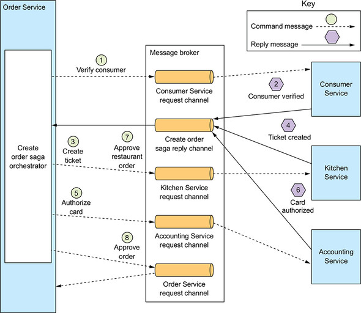

출처: Microservices Patterns with Examples in Java

① Saga Orchestrator는 소비자 서비스에 VerifyConsumer 커맨드를 전달한다. 

② 소비자 서비스는 ConsumerVerified라는 메시지로 응답한다. 

③ Saga Orchestrator는 주방 서비스에 CreateTicket 커맨드를 전송한다. 

④ 주방 서비스는 TicketCreated 메시지로 응답한다. 

⑤ Saga Orchestrator는 회계 서비스에 AuthorizeCard 커맨드를 전송한다. 

⑥ 회계 서비스는 CardAuthorized 메시지로 응답한다. 

⑦ Saga Orchestrator는 주방 서비스에 ApproveTicket 커맨드를 전송한다. 

⑧ Saga Orchestrator는 주문 서비스에 ApproveOrder 커맨드를 전송한다. 


마지막 단계에서 오케스트레이터는 자신이 주문 서비스의 일부 컴포넌트임에도 불구하고 주문 서비스에 커맨드 메시지를 전송한다. 원칙적으로 Create Order Saga는 직접 주문을 수정할 수도 있다. 하지만 정합성을 유지하기 위하여 주문 서비스를 단지 하나의 참여자로 취급하는 것이다. 


▶ 오케스트레이터를 상태 머신으로 모델링하기

Saga Orchestrator를 모델링하는 방법 중 하나는 이것을 상태 머신(state machine)으로 다루는 것이다. 하나의 상태 머신은 일련의 상태(State)와 이벤트들에 의해 촉진되는 상태 사이의 전이(Transition)로 구성된다. 상태 전이는 전이를 일으키는 행위, 즉 Saga 참여자에 대한 호출에 의해 발생하는데, 이는 Saga 참여자들이 수행하는 로컬 트랜잭션의 종료에 의해 촉발된다. 즉, 현재의 상태와 로컬 트랜잭션의 결과물에 따라 상태 전이와 수행할 행위가 결정된다. 아래는 Create Order Saga에 대한 상태 머신 모델을 보여준다. 

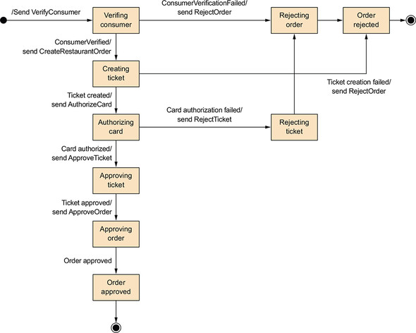

출처: Microservices Patterns with Examples in Java

· Verifying Consumer : 최초의 상태로 Saga는 소비자가 주문 가능한 상태인지 확인될 때까지 대기한다. 

· CreatingTicket : CreateTicket 커맨드에 대한 응답을 기다리고 있는 상태 

· Authorizing Card : 회계 서비스가 소비자의 신용카드 인증을 기다리는 상태

· Order Approved : Saga가 성공적으로 완료되었음을 나타내는 최종 상태

· Order Rejected : 참여자들 중 하나에 의해 주문이 거절되었음을 나타내는 최종 상태 


▶ 오케스트레이션의 장단점

오케스트레이션은 몇 가지 장점을 가지고 있다. 우선 오케스트레이션에서는 오케스트레이터만 참여자들을 호출하고 참여자들이 오케스트레이터를 호출하지 않기 때문에 순환적 의존성이 발생하지 않는다. 또한 Saga에 참여하는 서비스들이 오케스트레이터에 의해 호출될 API를 구현하기 때문에 상대적으로 느슨한 연결이 보장된다. 그리고 Saga의 조율 로직을 오케스트레이터에서 구현하기 때문에 도메인 객체의 비즈니스 로직은 좀 더 단순해지고 관심사의 분리(Separation of concerns)가 개선된다. 

하지만 오케스트레이션에는 단점도 있다. 우선 과도하게 많은 비즈니스 로직이 오케스트레이터 안에 들어갈 위험이 있다. 이것은 결국 오케스트레이터가 서비스가 수행해야 하는 오퍼레이션을 일일이 지시하는 형태의 설계로 이어질 수 있다. 이것을 피하기 위해서는 오케스트레이터가 오퍼레이션의 순서에 대해서만 책임을 지고 그 어떤 비즈니스 로직도 포함하지 않도록 설계해야 한다. 


#### 3. 격리성의 부족 해결하기

ACID에서 I는 격리성(Isolation)으로 복수의 트랜잭션을 동시에 실행시킨 결과가 해당 트랜잭션들을 순차적으로 실행시킨 결과와 같도록 보장하는 것을 의미한다. 그런데 Saga를 사용하면 Saga에 참여하는 로컬 트랜잭션에 의해 만들어진 변경사항이 커밋과 동시에 외부에 노출되기 때문에 격리성 저하가 발생하고 이로 인해 두 가지 문제가 발생한다. 첫째 특정 Saga가 실행되는 동안 Saga에 의해 수정된 데이터가 다른 Saga에 의해 변경할 수 있다. 둘째 특정 Saga가 변경사항을 업데이트하는 동안에 다른 Saga에서 해당 데이터를 읽어 갈수도 있다. 

결국 Saga를 사용하면 격리성의 부족으로 인해 데이터의 부정합이 발생할 수 있는데, 이를 데이터베이스 용어로 이상 현상(Anomaly)라 부른다. 따라서 격리성 부족으로 인해 발생하는 이상 현상을 보완하기 위해서는 Saga를 설계할 때 별도의 대응책이 필요하다. 


##### 3.1 격리성 부족으로 인한 이상 현상들

격리성의 부족은 아래와 같이 Lost Updates, Dirty Reads 그리고 Fussy/Nonrepeatable reads라는 이상 현상을 유발할 수 있다.


▶ Lost Updates 

특정 Saga에서 수정 중인 데이터를 다른 Saga에서 덮어 씌어 버리는 경우이다. 예를 들어 Create Order Saga의 첫 단계에서 주문을 생성한 후 Cancel Order Saga가 상기 주문을 취소해 버렸는데 다시 Create Order Saga의 마지막 단계에서 주문을 승인하는 경우가 이에 해당한다. 이 시나리오에서 Create Order Saga는 Cancel Order Saga가 만든 변경사항을 무시하고 덮어 씌어 버리게 되고 결국 취소된 주문이 배송되는 결과가 발생한다. 


▶ Dirty Reads

Dirty Read는 원래 다른 트랜잭션에 의해 수정됐지만 아직 커밋되지 않은 데이터를 읽는 것을 말한다. 이 경우 변경을 가한 트랜잭션이 최종적으로 롤백되면 그 값을 읽은 트랜잭션은 부정합 상태에 놓이게 된다. Saga의 경우 특정 Saga가 완료되지 않은 상태에서 수정이 진행 중인 데이터를 읽어 오게 되면 이와 같은 이상 현상이 발생한다. 


▶Fussy/Nonrepeatable reads

하나의 Saga를 구성하는 2개의 단계가 동일한 데이터를 읽었으나 중간에 다른 Saga에서 수행한 업데이트로 인해 다른 결과가 나오는 이상 현상을 의미한다. 


##### 3.2 격리성 부족에 대한 대응책 

Saga의 트랜잭션 모델은 ACD이고 이로 인한 격리성 부족은 앞서 설명한 이상 현황(anomalies)을 유발한다. 따라서 이상 현상을 막거나 비즈니스 영향이 최소화되도록 Saga를 설계해야 하는데, 이와 같이 격리성 부족으로 인해 발생하는 이상 현상을 해결하기 위한 주요 대응책으로는 Semantic Lock, Commutative Updates, Pessimistic View, Reread Value, Version File, By Value 등이 있다. 


▶ Saga의 구조

이상 현상을 막기 위한 대응책들을 살펴보기 전에 우선 Saga의 구조에 대해 알아보자. Saga는 아래와 같이 3가지 유형의 트랜잭션으로 구성된다. 

· 원복 가능 트랜잭션(Compensatable transactions) – 트랜잭션 실행 이전으로 원복 가능한 트랜잭션들

· 피봇 트랜잭션(Pivot Transaction) – Saga에서 Go와 No Go를 결정하는 분기점이 되는 트랜잭션 

· 재시도 트랜잭션(Retriable Transaction) – 피봇 트랜잭션 이후에 오는 성공이 보장된 트랜잭션. 

예를 들어 Create Order Saga에서 createOrder(), verifyConsumerDetails(), createTicket()는 원복 가능 트랜잭션이다. 이중 createOrder()와 createTicket()은 변경사항을 원복할 수 있는 원복 트랜잭션을 가지고 있지만, VerifyConsumerDetails()는 조회용이어서 원복 트랜잭션이 없다. authorizeCreditCard()는 피봇 트랜잭션으로 이 신용카드 트랜잭션이 승인되면 Saga는 최종 단계까지 모든 단계의 실행이 보장된다. approveOrder()와 approveTicket()은 피봇 트랜잭션에 이어지는 재시도 트랜잭션들이다. 


▶ Semantic Lock 

Semantic Lock을 사용하면 Saga의 원복 가능 트랜잭션들은 신규 생성하거나 수정하는 모든 레코드에 플래그를 설정한다. 이 플래그는 해당 레코드가 현재 수정 중으로 커밋되지 않았기 때문에 향후 변경될 수 있다는 것을 표시하는 것으로 다른 트랜잭션이 이 레코드에 접근하는 것을 막는 잠금장치 역할 또는 다른 트랜잭션이 이 레코드를 취급할 때 최종 데이터가 아닐 수 있다는 점을 고려해야 한다는 것을 알려주는 역할을 한다. 이 플래그는 Saga의 최종 단계에서 실행되는 재시도 트랜잭션 또는 Saga를 원복하는 원복 트랜잭션에 의해 클리어된다. 

Semantic Lock을 사용하려면 잠금장치(Lock)를 설정하는 것 외에 레코드가 잠겨 있는 경우 어떻게 처리할 것인지에 대해서도 결정해야 한다. 예를 들어 클라이언트에서 APPROVAL_PENDING 상태에 있는 주문의 취소를 요청하기 위해 cancelOrder()라는 오퍼레이션을 호출했다고 생각해 보자. 이 경우 한가지 옵션은 cancelOrder()를 실패 처리하고 클라이언트에게 나중에 다시 시도하라고 응답하는 것이다. 또 하나의 옵션은 레코드의 잠금이 해제될 때까지 cancelOrder()를 대기상태로 만드는 것이다. 


▶ Commutative Updates

격리성 부족에 대한 간단한 대응책 중 하나는 업데이트 오퍼레이션이 교환적이 되도록 설계하는 것이다. 만약 오퍼레이션이 순서를 바꿔서 실행해도 된다면 해당 오퍼레이션은 교환적(commutative)라고 할 수 있다. 예를 들어 회계의 Credit()과 Debit()은 교환적인 오퍼레이션이다. 이 대응책을 사용하면 Lost Update 문제를 해소할 수 있다. 


▶ Pessimistic View

또 다른 대응책으로 Pessimistic View가 있는데, 이것은 Dirty Read로 인한 비즈니스 영향을 최소화하기 위하여 Saga에 참여하는 단계들의 순서를 조정하는 것이다. 예들 들어 Create Order Saga에서 가용한 신용한도를 조회할 때 Dirty Read가 발생하여 신용 한도를 초과하는 주문이 생성되는 위험을 막기 위하여 Cancel Order Saga의 순서를 아래와 같이 조정할 수 있다. 

| 변경 전                                                      | 변경 후                                                      |
| ------------------------------------------------------------ | ------------------------------------------------------------ |
| [1] 소비자 서비스 – 가용한 신용한도 증가   [2] 주문 서비스 : 주문의 상태를 Cancelled로 변경   [3] 배송 서비스 – 배송 취소 처리 | [1] 주문 서비스: 주문의 상태를 Cancelled로 변경  [2] 배송 서비스 : 배송 취소 처리  [3] 소비자 서비스 : 가용한 신용한도 증가 |

상기와 같이 Saga의 순서를 조정하면 가용한 신용한도는 마지막에 실행되는 재시도 트랜잭션에 의해 증가되기 때문에 Dirty Read의 위험을 감소시킬 수 있다. 


▶ Reread Value

Reread Value는 Lost Update이 발생하지 않도록 해주는 대응책이다. 이 대응책을 적용하면 Saga는 데이터베이스의 레코드를 업데이트하기 전에 해당 레코드를 다시 읽어서 변경되지 않았는 지를 확인한 후에 업데이트를 진행한다. 만약 변경이 발생하였다면 Saga는 중단되고 경우에 따라 재시작된다. 이 대응책은 일종의 Optimistic Offline Lock 패턴과 유사하다.([https://martinfowler.com/eaaCatalog/optimistic OfflineLock.html)](https://martinfowler.com/eaaCatalog/optimistic OfflineLock.html))


▶ Version File

Version File은 비교환적인 오퍼레이션을 교환적 오퍼레이션으로 변경하는 대응책이다. 예를 들어 Create Order Saga와 Cancel Order Saga가 동시에 실행되는 시나리오를 생각해보자. Semantic Lock을 사용하지 않는다면 Cancel Order Saga는 Create Order Saga가 신용카드 승인을 처리하기 전에 신용카드 승인을 취소할 수 있다. 회계 서비스가 이 비정상적인 요청을 처리하는 한가지 방법은 요청이 도착했을 때 오퍼레이션을 기록하였다가 제대로 된 순서대로 그것들을 실행하는 것이다. 이 시나리오에서는 먼저 Cancel Authorization 요청을 기록한다. 그런 후 회계 서비스가 Authorize Card 요청을 수취했을 때 Cancel Authorization 요청이 수취되었음을 알리고 신용카드 승인을 건너뛰는 것이다. 


▶ By Value

마지막 대응책은 By Value로, 이것은 비즈니스 리스크에 기반하여 선택하는 동시성 메커니즘 전략이다. 이 대응책을 사용하는 애플리케이션은 각 요청의 속성에 따라 Saga와 분산 트랜잭션 중 어떤 것을 사용할 지를 결정한다. 저위험 요청에 대해서는 앞에서 설명한 대응책들이 적용된 Saga를 이용하지만, 고위험 요청에 대해서는 분산 트랜잭션을 사용한다. 이 전략을 통해 비즈니스 위험성, 가용성 그리고 확장성 사이의 균형을 동적으로 조정할 수 있다. 


 

### 5장. 마이크로서비스의 비즈니스 로직 설계

#### 1. 비즈니스 로직을 구성하기 위한 패턴들


비즈니스 로직은 통상 서비스의 가장 중요하고 복잡한 부분이다. 따라서 일반적인 서비스 아키텍처는 오른쪽 그림과 같이 통상 비즈니스 로직을 육각형 아키텍처의 중심에 두고 인바운드 및 아웃바운드 어댑터들이 이를 둘러싸고 있는 구조로 보여준다. 이러한 비즈니스 로직은 애플리케이션에 가장 적합한 구조가 되도록 해야 하는데, 비즈니스 로직을 설계할 때 결정해야 하는 중요한 의사결정 중의 하나가 객체 지향 방식과 절차적 방식 중 어떤 것을 사용할 지를 결정하는 것이다. 정리하면 비즈니스 로직을 구성할 때 사용할 수 있는 2개의 패턴이 있는데, 하나는 절차적 트랜잭션 스크립트 패턴(Procedural Transaction Script Pattern)이고 다른 하나는 객체 지향 도메인 모델 패턴(Object-oriented Domain Model Pattern)이다. 


##### 1.1 트랜잭션 스크립트 패턴

트랜잭션 스크립트 패턴(Transaction Script Pattern)은 각각의 요청 유형에 대해 하나씩 절차적 트랜잭션 스크립트를 만들고 이들의 묶음으로 비즈니스 로직을 구성하는 설계 패턴이다. 이 방식은 지극히 절차적이며 객체 지향 프로그래밍(OOP) 언어의 특성에는 크게 의존하지 않는다. 이것은 주로 비 객체 지향 언어를 사용하여 프로그램을 작성할 때 사용하는 방법으로 간단한 로직의 경우엔 잘 동작한다. 따라서 간단한 비즈니스 로직을 개발하는 경우에는 객체 지향 방식 대신 절차적 방식으로 코드를 작성하는 트랜잭션 스크립트 패턴을 사용하는 것도 괜찮은 방법이다. 

사실 절차적 방법의 간소함은 상당한 매력이 있다. 문제는 비즈니스 로직이 복잡해지면 유지보수가 너무나 어려워진다는 것이다. 모노리틱 애플리케이션이 점진적으로 비대해졌던 것처럼 트랜잭션 스크립트에서도 동일한 문제가 발생한다. 결국 간단한 애플리케이션을 만드는 것이 아니라면 절차적 방식으로 코드를 작성하고자 하는 유혹을 거부하고 도메인 모델 패턴을 적용하여 객체 지향 방식으로 진행해야 한다. 


##### 1.2 도메인 모델 패턴

객체 지향 설계에서 비즈니스 로직은 상대적으로 작은 클래스들의 네트워크인 객체 모델로 구성된다. 여기서 클래스들은 도메인에서 도출된 개념들과 직접적으로 매칭되는데, 어떤 클래스들은 행위와 상태 중 하나만을 가지는 경우도 있지만, 대부분의 클래스는 행위와 상태를 모두 가지며, 이것이 잘 설계된 클래스의 특징이다. 정리하면 도메인 모델 패턴(Domain Model Pattern)은 비즈니스 로직을 행위(behavior)와 상태(state)를 가지는 클래스들로 구성된 객체 모델로 구성하는 패턴이다.

객체 지향 설계를 사용하는 것은 여러 가지 장점이 있다. 먼저 객체 지향 설계는 모든 기능을 포함하고 있는 하나의 거대한 클래스를 만드는 대신에 각각 소수의 역할만을 수행하는 다수의 소규모 클래스들로 구성하기 때문에 이해하기 쉽고 유지보수가 쉽다. 게다가 Account, BankingTransaction, OverdraftPolicy와 같은 클래스들은 실제 세상을 모방하고 있어서 해당 클래스의 역할을 이해하기가 쉽다. 둘째로 객체 지향 설계는 테스트가 쉽다. 각각의 클래스는 독립적으로 테스트될 수 있고 테스트되어야 한다. 마지막으로 객체 지향 설계는 확장이 용이하다. 이는 객체 지향 설계가 전략 패턴, 템플릿 메소드 패턴과 같이 코드 수정 없이 확장할 수 있는 패턴을 사용할 수 있기 때문이다.


##### 1.3 도메인 주도 설계

Eric Evans가 도메인 주도 설계(Domain-Driven Design, Addison-Wesley Professional, 2003)라는 책에서 정리한 DDD는 OOD의 개정판으로 복잡한 비즈니스 로직의 개발에 적합하다. DDD에서 서비스는 각자 독립적인 도메인 모델을 가지기 때문에 애플리케이션 전체가 단일 도메인 모델을 가짐으로 인해 발생하는 문제들을 피할 수 있다. 앞서 살펴보았던 서브 도메인(Sub Domain) 및 이와 연관된 제한 영역(Bounded Context)의 개념도 DDD에서 제시하는 개념들이다. 

DDD는 도메인 모델을 구성하는 몇 가지 전술적 패턴들도 제시하고 있는데, 각각의 패턴은 클래스가 도메인 모델에서 수행하는 역할과 특징을 정의한다. 이중 널리 채택되고 있는 것들은 아래와 같다.

· 엔티티(Entity) – 영구적인 정체성을 가지는 객체. 

· 값 객체(Value Object) – 속성 값들의 집합인 객체. 

· 팩토리(Factory) – 생성자를 가지고 직접 생성하기에는 너무 복잡한 객체 생성 로직을 구현한 객체 또는 메소드. 

· 저장소(Repository) – DB 접속 메커니즘은 캡슐화하여 숨기고 영속적인 엔티티에 대한 접근을 제공하는 객체

· 서비스(Service) – 엔티티(Entity)나 값 객채(Value Object)에 속하지 않는 비즈니스 로직을 구현하는 객체

상기의 패턴 외에 DDD 추종자가 아니라면 자주 고려하지 않는 패턴 중에서 마이크로서비스 아키텍처에 매우 유용한 패턴이 하나 더 있는데 바로 아래에서 설명할 집합체(Aggregate)가 그것이다. 


#### 2. 도메인 주도 설계의 집합체 패턴

##### 2.1 전통적인 객체 지향 설계의 문제점

전통적인 객체 지향 설계에서 도메인 모델은 클래스들과 이들 사이의 관계들의 집합으로, 통상 다수의 클래스들이 모여서 하나의 패키지를 구성한다. 예를 들어 아래의 그림은 음식 배달 애플리케이션을 위한 도메인 모델의 일부로 비즈니스 객체에 대응되는 클래스들과 클래서들을 상호 연결하는 관계들을 보여준다. 

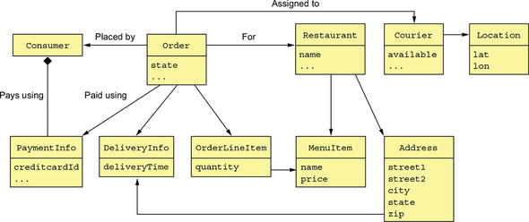

그런데 상기와 같은 전통적인 도메인 모델에서는 각 비즈니스 객체들 사이의 경계가 명시적으로 표시되지 않는다. 경계가 명확하게 표현되지 않음으로 인해 종종 문제들이 발생하는데, 특히 마이크로서비스 아키텍처에서는 더욱 문제가 된다. 예를 들어 주문이라는 비즈니스 객체를 생성 또는 삭제한다고 가정해보자. 이 오퍼레이션은 정확히 어떤 작업을 해야 하고 그 범위는 어디까지인가? 실제 주문에서 처리해야 하는 것은 단순히 주문 객체만이 아니다. 주문의 상세 아이템들, 지불 정보 및 기타 여러 가지가 있는데, 상기의 그림은 이와 같은 부분이 명확히 표현되지 않아서 그저 개발자의 직관에 맡길 수 밖에 없다. 

개념적인 모호성에 더하여 경계를 명시적으로 표시하지 않는 것은 비즈니스 객체를 업데이트할 때 또 다른 문제를 야기한다. 통상 비즈니스 객체는 불변 규칙(invariants), 즉, 항시 준수해야 하는 비즈니스 규칙을 가지고 있다. 예를 들면 주문은 최소 주문 금액을 가지며, 애플리케이션은 주문을 업데이트할 때 최소 주문 금액과 같은 불변 규칙을 어기지 않도록 보장해주어야 한다. 그런데 객체 간의 경계가 명확하지 않으면 불변 규칙을 준수하도록 비즈니스 로직을 설계하기가 어려워 진다. 


##### 2.2 명시적인 경계의 표시 

집합체(Aggregate)는 동일한 경계 안에서 하나의 유닛으로 관리될 수 있는 도메인 객체들의 집합이다. 이것은 하나의 루트 엔티티(Root Entity)와 하나 또는 그 이상의 엔티티(Entity) 및 값 객체(Value Object)들로 구성된다. 예를 들어 아래의 그림은 주문 집합체와 그것의 경계를 보여준다. 주문 집합체는 주문 엔티티, 하나 또는 그 이상의 주문 라인 아이템, 그리고 주소, 지불 정보와 같은 기타의 값 객체로 구성된다. 


집합체는 도메인 모델을 좀 더 이해하기 쉬운 큰 덩어리들로 분해한다. 이것들은 생성, 수정, 삭제와 같은 오프레이션의 범위를 명확히 해준다. 즉, 오퍼레이션은 집합체의 일부가 아닌 전체에 대해 수행된다. 예를 들어 집합체를 삭제하면 데이터베이스에서 해당 집합체와 관련된 모든 객체가 일괄적으로 삭제된다. 

집합체에 대해 일부 업데이트가 아닌 전체 일괄 업데이트하는 것은 정합성 이슈를 해결해준다. 그리고 불변 규칙을 준수하려면 집합체의 루트 엔티티를 통해서만 업데이트 오퍼레이션을 수행해야 한다. 여기서 동시성 문제는 버전 번호 또는 데이터베이스 레벨의 락을 이용하여 집합체의 루트 엔티티를 잠금으로써 해결할 수 있다. 


##### 2.3 집합체가 준수해야 하는 규칙들

DDD에서 집합체는 몇 가지 규칙을 준수해야 한다. 이 규칙들을 준수할 때 집합체는 불변 규칙을 준수하는 독립적인 유닛이 된다. 집합체가 준수해야 하는 규칙들은 아래와 같다. 

▶ 규칙#1: 집합체는 루트 엔티티를 통해서만 참조할 수 있다. 

첫번째 규칙은 집합체 외부의 클래스들은 집합체의 루트 엔티티를 통해서만 집합체에 속한 클래스들에 접근할 수 있다는 것이다. 클라이언트는 루트 엔티티의 메소드를 호출함으로써만 집합체에 속한 객체들의 정보를 업데이트할 수 있다. 이 규칙의 목적은 집합체에 속한 다른 클래스를 직접 참조함으로 인해 발생하는 정합성 이슈를 제거하는 것으로, 이 규칙은 집합체가 불변 규칙을 준수하도록 보장해준다. 


▶ 규칙#2: 집합체 간의 참조는 Primary Key를 이용한다. 

또 하나의 규칙은 집합체가 서로를 참조할 때 객체에 대한 레퍼런스가 아니라 Primary Key를 가지고 참조한다는 것이다. 이 부분은 전통적인 객체 모델링과 상당한 차이가 있는데, 전통적인 객체 모델링에서는 도메인 모델에서 외부 키를 사용하면 문제가 있는 설계라고 생각하지만, 이 방법은 여러가지 이점이 있다. 우선 객체를 직접 참조하지 않고 객체에 대한 식별자(Primary Key)를 통해 참조하기 때문에 집합체 간의 관계가 느슨한 연결 상태가 되도록 해준다. 이를 통해 집합체들 사이의 경계가 명확해지고 실수로 다른 집합체를 업데이트 하지 않도록 보장해 준다. 

그리고 집합체는 저장 단위이므로 영속성 처리를 간소화해준다. 즉, MongoDB와 같은 NoSQL 데이터베이스에 집합체의 저장을 더욱 쉽게 해준다. 이것은 또한 투명한 지연 로딩 및 이와 관련된 문제들을 해소한다. 또한 이 방법을 사용하여 집합체를 샤딩하여 데이터베이스를 확장하는 것도 상대적으로 간단하다. 


▶ 규칙#3: 하나의 트랜잭션은 하나의 집합체만을 생성/수정한다. 

집합체가 준수해야 하는 또 하나의 규칙은 하나의 트랜잭션은 하나의 집합체만 생성 또는 수정해야 한다는 것이다. 이것은 RDBMS를 사용하는 전통적인 모노리틱 애플리케이션에서는 적합하지 않지만, 마이크로서비스 아키텍처에서는 꼭 필요한 규칙이다. 이 규칙은 하나의 트랜잭션이 하나의 서비스 범위를 벗어나지 않도록 보장해주며, 대부분의 NoSQL 데이터베이스의 제한된 트랜잭션 모델과도 잘 들어 맞는다. 

하지만 이 규칙은 복수의 집합체를 생성 또는 수정해야 하는 오퍼레이션의 구현을 매우 어렵게 만드는데, 이것이 어쩌면 Saga를 이용하는 이유이다. Saga의 각 단계는 정확히 하나의 집합체만 생성하거나 수정한다. 

##### 2.4 집합체의 크기 결정

도메인 모델을 개발할 때 중요한 결정사항 중 하나는 집합체를 어떤 크기로 만들것이냐를 결정하는 것이다. 어찌보면 집합체는 규모가 작은 것이 이상적이다. 각 집합체의 업데이트 요청은 직렬화되기 때문에 집합체가 작을 수록 처리할 수 있는 동시 요청의 수가 늘어나고 이로 인해 확장성이 개선된다. 또한 동일한 집합체에 대한 동시 업데이트가 발생할 가능성도 감소하여 사용자 경험도 개선된다. 

하지만 집합체는 하나의 트랜잭션이 동작하는 범위이기 때문에 원자적 업데이트를 위해서는 집합체의 규모가 클 수록 유리하다. 예를 들어 만약 주문 집합체와 소비자 집합체를 하나의 집합체로 묶게 되면 주문과 소비자을 동시에 원자적으로 업데이트할 수 있다는 장점이 있다. 하지만 이 방안은 확장성이 떨어지고 다수의 사용자가 동일한 정보를 수정하고자 할 때 충돌이 발생할 가능성도 커진다. 또한 이것은 마이크로서비스로의 분해를 방해하는 장애물이 된다. 이러한 문제들로 인해 집합체는 가능한 작게 세분화하여 만드는 것이 좋다. 

##### 2.5 집합체를 이용한 비즈니스 로직의 설계

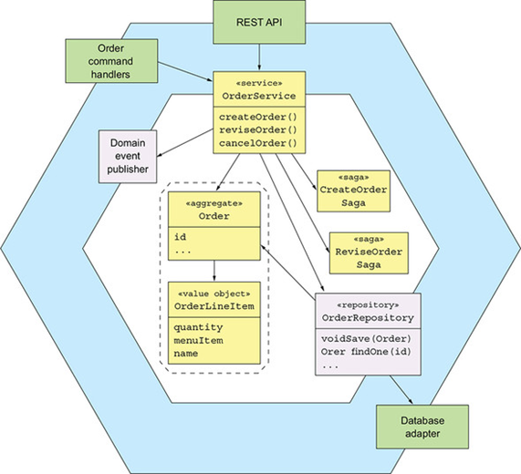

일반적인 마이크로서비스 아키텍처의 경우 비즈니스 로직의 상당 부분은 집합체로 구성된다. 그리고 나머지 부분은 Saga와 도메인 서비스들로 채워진다. Saga는 데이터 정합성을 강화하기 위하여 로컬 트랜잭션의 순서를 조율한다. 서비스는 비즈니스 로직으로 들어가는 엔트리 포인트로 인바운드 어댑터들에 의해 호출되고, 데이터베이스로부터 집합체를 꺼내오거나 데이터베이스에 집합체를 저장하기 위하여 저장소(Repository)를 사용한다. 그리고 각 저장소는 데이터베이스에 접속하는 아웃바운드 어댑터에 의해 구현된다. 

오른쪽의 그림는 주문 서비스를 위한 집합체 기반의 비즈니스 로직 설계의 예이다. 비즈니스 로직은 주문 집합체, 주문 서비스, 주문 저장소, 그리고 하나 또는 그 이상의 Saga로 구성된다. 주문 서비스는 주문을 저장하거나 읽어오기 위하여 주문 저장소를 호출한다. 간단한 로컬 요청들의 경우엔 주문 서비스가 직접 주문 집합체를 업데이트하지만, 만약 복수의 서비스에 걸쳐서 업데이트해야 하는 요청이라면 Saga를 생성하여 해당 오퍼레이션을 수행한다. 


#### 3. 도메인 이벤트 패턴

##### 3.1 도메인 이벤트

DDD의 관점에서 보면 도메인 이벤트는 집합체에 발생한 어떤 사건, 구체적으로는 집합체의 상태 변화를 일으키는 사건들을 의미한다. 예를 들어 주문 집합체의 경우 상태를 변화시키는 이벤트에는 주문 생성(Order Created), 주문 취소(Order Cancelled), 주문 배송(Order Shipped) 등이 있고, 주문 집합체는 이러한 상태 변화가 발생할 때마다 이 집합체와 관련이 있는 소비자들에게 이벤트를 게시한다. 정리하면 집합체가 생성되거나 또는 기타의 의미 있는 변화가 발생할 때마다 연관이 있는 소비자들에게 이벤트를 게시하는 패턴을 도메인 이벤트 패턴(Domain Event Pattern)이라고 한다

도메인 이벤트는 과거분사 형태의 동사를 이름으로 가지는 클래스로 표현되며, 발생한 사건에 대해 충분한 정보를 전달하기 위하여 부가적인 속성들을 가지는데, 이 속성들은 통상 원시 값(Primitive Value) 또는 값 객체(Value Object)로 되어 있다. 일반적으로 도메인 이벤트는 메타 데이터와 타임 스탬프를 가지고 있고, 또한 변경 사항을 만든 사용자에 대한 식별자도 가지고 있다. 

##### 3.2 도메인 이벤트 식별하기

도메인 이벤트를 식별하기 위한 전략이 몇 가지 있는데, 그중 최근 유행하는 것이 이벤트 스토밍(Event Storming)이다. 이벤트 스토밍은 복잡한 도메인을 이해하기 위해 도메인 전문가들을 한방에 모아 놓아야 하고 많은 수의 포스트잇 메모장과 이 메모장을 붙일 화이트보드, 페이퍼 롤과 같은 것을 제공하여 진행하는 일종의 이벤트 식별 워크샵이다. 이러한 이벤트 스토밍은 아래와 같이 3개의 주요 단계로 구성되어 있다. 

1) 이벤트 도출하기 – 도메인 전문가들이 브레인스토밍을 통해 도메인 이벤트를 도출한다. 
2) 이벤트 트리거 식별하기 – 도메인 전문가들이 각각의 이벤트에 대해 촉발 요인을 식별한다. 
3) 집합체 식별하기 – 도메인 전문가들이 각 커맨드를 소비하는 집합체를 식별하고 대응되는 이벤트를 표시한다. 

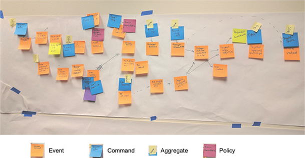

상기 그림은 이벤트 스토밍 워크샵의 결과를 보여준다. 1-2시간 안에 참여자들은 많은 수의 도메인 이벤트, 커맨드와 집합체를 식별하는데, 이것은 도메인 모델을 생성하는 과정의 첫 단계이다. 이벤트 스토밍은 신속하게 도메인 모델을 생성하기에 매우 유용한 기술이다. 

##### 3.3 도메인 이벤트 생성하고 게시하기

개념적으로 보면 도메인 이벤트는 집합체에 의해 게시된다. 집합체는 언제 상태가 변하고 그때 어떤 이벤트를 게시해야 하는지 알기 때문에 집합체가 메시징 API를 직접 호출하여 이벤트를 게시할 수도 있다. 하지만 집합체는 의존성 주입을 사용할 수 없기 때문에 이 방법을 사용하려면 메시징 API를 메소드의 인수로 전달해야 한다는 문제점이 있고, 이것은 인프라스트럭처 관심사와 비즈니스 로직을 결합하게 되어 바람직하지 못하다. 

좀 더 나은 방법은 집합체와 이것을 호출한 서비스 사이에 역할을 분리하는 것이다. 집합체는 상태 변화가 발생하면 이벤트를 생성하여 이것을 서비스에게 돌려주고, 서비스는 의존성 주입을 통해 메시징 API에 대한 참조를 얻고 이를 이용하여 이벤트를 게시하는 것이다. 여기서 집합체가 이벤트를 서비스에 돌려주는 방법에는 몇 가지가 있는데, 한 가지 방법은 집합체 메소드의 반환 값에 이벤트를 포함하는 것이다. 예를 들어 아래의 예제 코드는 티켓 집합체의 accept() 메소드가 자신을 호출한 서비스에게 TicketAcceptedEvent를 반환하는 것을 보여준다. 

```java
public class Ticket {
  public List<DomainEvent> accept(ZonedDateTime readyBy) {
  	...
  	this.acceptTime = ZonedDateTime.now();
  	this.readyBy = readyBy;
  	return singletonList(new TicketAcceptedEvent(readyBy));
  }
}
```

집합체로부터 이벤트를 회신받은 서비스는 메시징 API를 호출하여 이를 게시한다. 아래의 예제 코드는 주방 서비스(Kitchen Service)가 상기의 메소드를 호출하여 이벤트를 회신받고 이를 게시하는 것을 보여준다. 

```java
public class KitchenService {

 @Autowired
 private TicketRepository ticketRepository;

 @Autowired
 private DomainEventPublisher domainEventPublisher;

 public void accept(long ticketId, ZonedDateTime readyBy) {
 	 Ticket ticket =
​ 	    ticketRepository.findById(ticketId)
​	      .orElseThrow(() ->
​ 	          new TicketNotFoundException(ticketId));

	  List<DomainEvent> events = ticket.accept(readyBy);
	  domainEventPublisher.publish(Ticket.class, orderId, events);
	}
}
```

상기 외에 집합체는 발생한 이벤트를 특정 필드에 계속 쌓아 놓고, 서비스들이 저장된 이벤트를 추출하여 게시하는 방법도 있다. 하지만 이 방법을 사용하려면 집합체의 루트 엔티티가 중복 코딩을 줄이기 위해 상위 클래스를 상속받아야 하는데, 다른 어떤 상위 클래스를 상속받아야 하는 요구사항이 있을 경우에는 사용할 수가 없다. 

그리고 도메인 이벤트를 관련 서비스들에게 신뢰성 있게 전달하기 위해서는 서비스가 데이터베이스의 집합체를 업데이트하는 트랜잭션의 일부로 이벤트를 게시하는 트랜잭션 메시징 패턴을 사용해야 한다. 즉, 데이터베이스를 업데이트하는 ACID 트랜잭션의 일부로 OUTBOX 테이블에 이벤트를 삽입하고, 트랜잭션이 커밋된 후에 OUTBOX 테이블에 삽입된 이벤트를 읽어서 메시지 브로커에 게시해야 한다. 

##### 3.4 도메인 이벤트 사용하기 

도메인 이벤트는 결국 메시지 형태로 전환되어 Apache Kafka와 같은 메시지 브로커에 게시된다. 메시지 소비자는 DomainEventDispatcher와 같은 메시지 브로커의 클라이언트 API를 직접 호출하여 도메인 이벤트를 적절한 이벤트 핸들러에게 전달하고, 이것을 다시 비즈니스 로직에 전달하여 처리한다. 아래는 식당 서비스에서 메뉴가 업데이트될 때마다 게시된 이벤트를 구독하여 주방 서비스가 가지고 있는 메뉴에 대한 데이터 복제본을 업데이트하고 최신 상태로 유지하는 이벤트 핸들러 클래스의 예제이다. 

```java
public class KitchenServiceEventConsumer {

 @Autowired
 private RestaurantService restaurantService;

 public DomainEventHandlers domainEventHandlers() {
   return DomainEventHandlersBuilder
		    .forAggregateType("net.chrisrichardson.ftgo.restaurantservice.Restaurant")
   			.onEvent(RestaurantMenuRevised.class, this::reviseMenu)
			.build();
 }
 
 public void reviseMenu(DomainEventEnvelope<RestaurantMenuRevised> de) {
  	long id = Long.parseLong(de.getAggregateId());
  	RestaurantMenu revisedMenu = de.getEvent().getRevisedMenu();
  	restaurantService.reviseMenu(id, revisedMenu);
 }
}
```


 